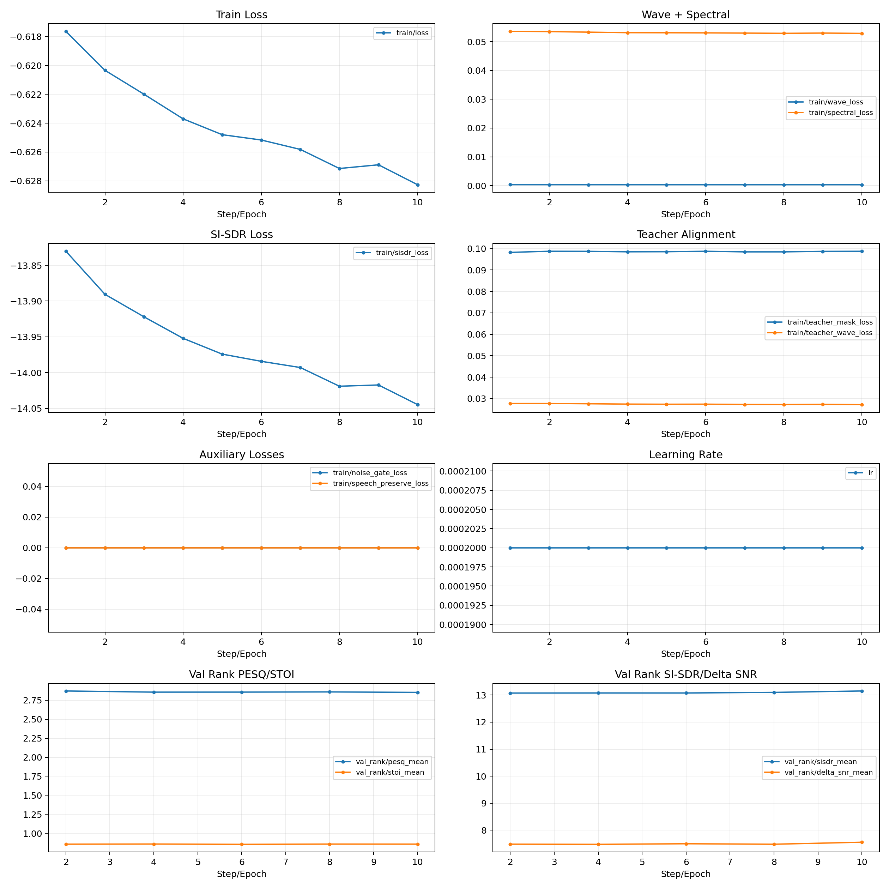
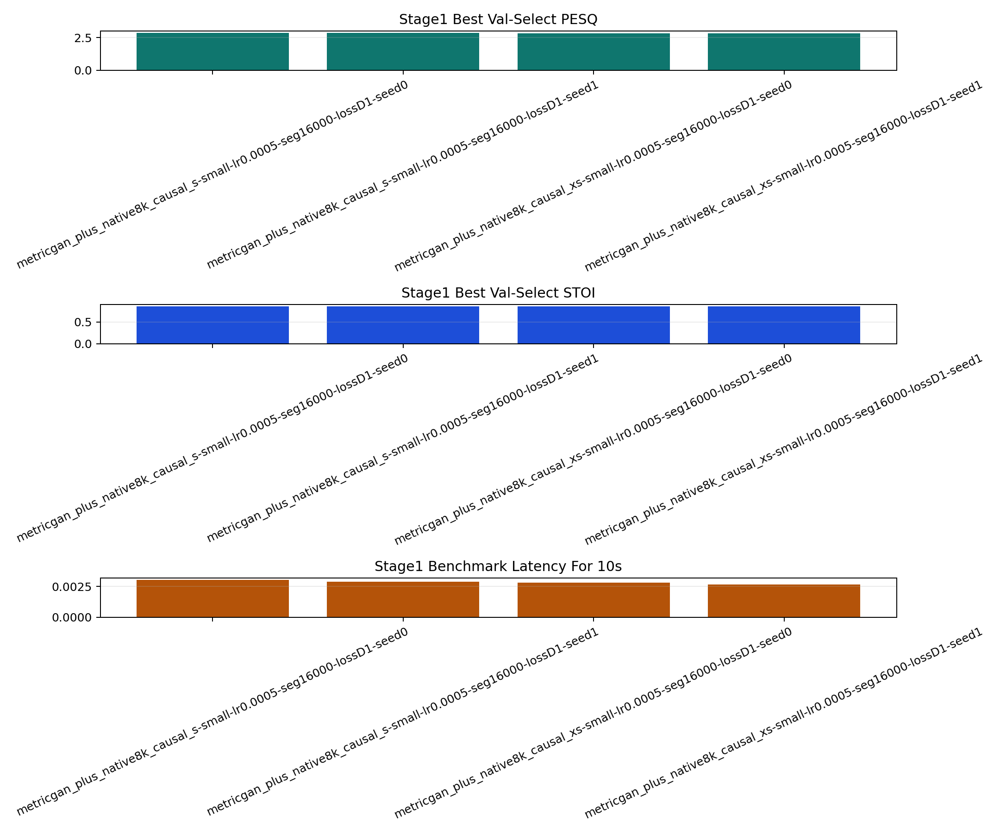
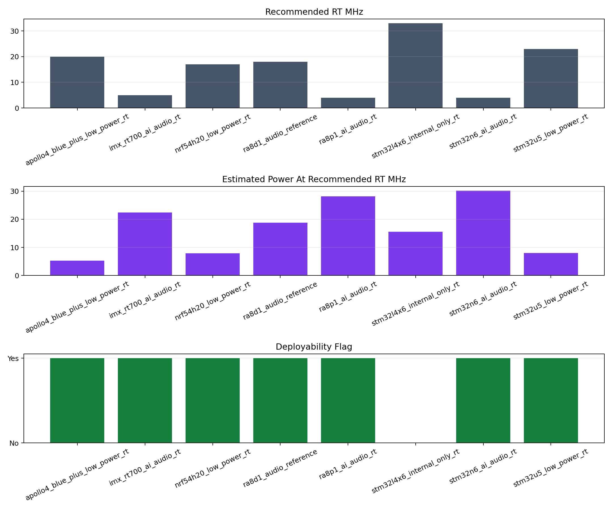
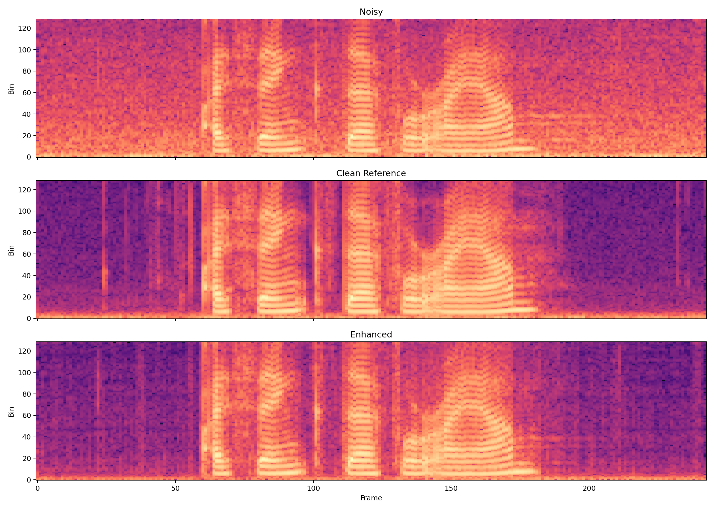

# Documentatie Extinsa Pentru Linia `VoiceBank+DEMAND -> native8k teacher -> causal_s student -> QAT -> MCU`

Acest document extinde README-ul operational si documenteaza la nivel tehnico-stiintific linia finala deployable din proiectul `metricgan_plus_native8k_causal_s_repro`.

## Legenda Editoriala

Pe tot parcursul documentului sunt folosite explicit urmatoarele etichete:

- **Fapt confirmat din repo**: informatie verificata direct din cod, configuri, checkpoint-uri sau artefacte locale.
- **Masura derivata din artefacte**: informatie calculata pornind de la valori logate local, nu metrica logata ca atare.
- **Analiza / inferenta**: interpretare tehnica sustinuta de cod, artefacte si literatura, dar care nu este ea insasi o metrica logata.
- **Comparatie externa**: pozitionare fata de literatura sau surse oficiale externe.
- **Ipoteza**: afirmatie de lucru formulata explicit, pe care rezultatele si analiza incearca sa o confirme sau sa o infirme.
- **Amenintare la validitate**: factor care poate limita forta concluziilor, generalizarea sau comparabilitatea rezultatelor.
- **Implicatie practica**: consecinta inginereasca directa a unui rezultat, utila pentru decizia de produs sau de deployment.
- **Limitare / neacoperit**: lucru care nu este demonstrat de repo sau care ramane in afara protocolului curent.

## Table of Contents

- [Abstract](#abstract)
- [Cuvinte-cheie](#cuvinte-cheie)
- [Lista simbolurilor si notatiilor](#lista-simbolurilor-si-notatiilor)
- [Lista acronimelor](#lista-acronimelor)
- [Contributiile lucrarii](#contributiile-lucrarii)
- [1. Introducere si problema](#1-introducere-si-problema)
- [2. Context teoretic, model formal si pozitionare in literatura](#2-context-teoretic-model-formal-si-pozitionare-in-literatura)
- [3. Dataset protocol si splituri](#3-dataset-protocol-si-splituri)
- [4. Metrici de evaluare](#4-metrici-de-evaluare)
- [5. Arhitecturi si modele relevante](#5-arhitecturi-si-modele-relevante)
- [6. Teacher distilare si QAT](#6-teacher-distilare-si-qat)
- [7. Rezultate experimentale si discutie](#7-rezultate-experimentale-si-discutie)
- [8. Analiza deployability pe MCU](#8-analiza-deployability-pe-mcu)
- [9. Diferenta 16 kHz vs 8 kHz](#9-diferenta-16-khz-vs-8-khz)
- [10. Fezabilitate pentru platforme low-power aeriene](#10-fezabilitate-pentru-platforme-low-power-aeriene)
- [11. Limitari si directii viitoare](#11-limitari-si-directii-viitoare)
- [12. Reproductibilitate](#12-reproductibilitate)
- [13. Amenintari la validitate si consideratii etice](#13-amenintari-la-validitate-si-consideratii-etice)
- [14. Concluzii](#14-concluzii)
- [15. Referinte](#15-referinte)

## Abstract

**Fapt confirmat din repo**

Linia finala a proiectului este:

`VoiceBank+DEMAND -> metricgan_plus_native8k_small (teacher) -> teacher cache -> metricgan_plus_native8k_causal_s (student) -> QAT D2 -> evaluare -> simulare MCU`

Checkpoint-ul final de produs este `metricgan_plus_native8k_causal_s-small-lr0.0002-seg16000-lossD2-seed0`, iar artefactele canonice sunt in `outputs/evaluations/reference_qat/` si `outputs/reports/reference_qat/`.

**Fapt confirmat din repo**

Performanta finala pe `VoiceBank+DEMAND 8 kHz` este:

| Split / audit | PESQ | STOI | SI-SDR | Delta SNR | Alte valori |
|---|---:|---:|---:|---:|---|
| `val_rank` | 2.8528 | 0.8580 | 13.1508 | 7.5571 | `count=128` |
| `val_select` | 2.8608 | 0.8538 | 13.3801 | 7.4184 | `count=1690`, `benchmark_latency_10s=0.0036808 s` |
| `test` | 3.3269 | 0.9335 | 17.9188 | 9.5703 | `count=824` |

**Fapt confirmat din repo**

Modelul are `94,562` parametri, `16 ms` lookahead si trece verdictul `deployment_ok=true` pe sase profile din raportul principal `reference_qat`: `STM32U5`, `nRF54H20`, `Apollo4 Blue+`, `i.MX RT700`, `STM32N6`, `RA8P1`. In auditul extins `reference_qat_full`, acelasi checkpoint mai trece si profilele `Alif Ensemble E3` si `Alif Ensemble E6`.

**Masura derivata din artefacte**

Raportat la teacher-ul `native8k` de `1,652,058` parametri, studentul final comprima numarul de parametri cu un factor de aproximativ `17.47x`, adica o reducere de `94.28%`.

**Analiza / inferenta**

Concluzia tehnica a proiectului nu este ca studentul final bate teacher-ul la calitate bruta. Concluzia este mai precisa: `causal_s` dupa QAT este cel mai bun compromis validat local intre calitate audio, latenta, lookahead, footprint si fezabilitate MCU low-power. Teacher-ul ramane reperul de calitate; studentul este modelul de produs.

**Limitare / neacoperit**

Acest document este strict despre ramura deployable `8 kHz` pe `VoiceBank+DEMAND`. Configurile `DNS5`, `combined` si `reference_scenario` exista in repo, dar nu sunt metoda finala documentata aici.

## Cuvinte-cheie

speech enhancement, distilare teacher-student, quantization-aware training, low-power MCU, inferenta in timp real, VoiceBank+DEMAND, narrowband speech, on-device deployment

## Lista simbolurilor si notatiilor

| Simbol | Semnificatie |
|---|---|
| `x[n]` | esantionul de intrare zgomotoasa |
| `s[n]` | semnalul de vorbire curat |
| `v[n]` | componenta de zgomot aditiv |
| `X_{t,f}` | STFT-ul semnalului zgomotos la cadrul temporal `t` si binul spectral `f` |
| `Z_{t,f}` | magnitudinea comprimata, `|X_{t,f}|^{0.5}` |
| `M_theta(t,f)` | masca estimata de studentul parametrizat de `theta` |
| `S_hat(t,f)` | spectrul enhanced reconstruit |
| `s_hat[n]` | semnalul enhanced in domeniul timp |
| `T` | teacher-ul `native8k` |
| `S` | studentul cauzal `causal_s` sau `causal_xs` |
| `y_T[n]` | unda enhanced produsa offline de teacher |
| `E_T(t,b)` | masca teacher in domeniul ERB, pe cadrul `t` si banda `b` |
| `L_{D1}`, `L_{D2}` | functiile de pierdere folosite in `stage1`, respectiv `QAT` |

## Lista acronimelor

| Acronym | Forma extinsa |
|---|---|
| `STFT` | Short-Time Fourier Transform |
| `iSTFT` | inverse Short-Time Fourier Transform |
| `ERB` | Equivalent Rectangular Bandwidth |
| `QAT` | Quantization-Aware Training |
| `PTQ` | Post-Training Quantization |
| `KD` | Knowledge Distillation |
| `MCU` | Microcontroller Unit |
| `NPU` | Neural Processing Unit |
| `PESQ` | Perceptual Evaluation of Speech Quality |
| `STOI` | Short-Time Objective Intelligibility |
| `SI-SDR` | Scale-Invariant Signal-to-Distortion Ratio |
| `DNSMOS` | Deep Noise Suppression Mean Opinion Score |
| `VCTK` | corpusul de vorbire folosit la constructia VoiceBank |

## Contributiile lucrarii

**Fapt confirmat din repo**

Contributiile verificabile ale acestei linii sunt urmatoarele:

1. definirea unei linii complete `teacher -> distilare -> student cauzal -> QAT -> evaluare -> audit MCU` pentru `VoiceBank+DEMAND 8 kHz`;
2. dezvoltarea unui student cauzal compact, cu `94,562` parametri si `16 ms` lookahead, orientat explicit spre deployment on-device;
3. integrarea unei etape `QAT` usoare, cu perturbari de cuantizare in forward, compatibila cu verdictul final `deployment_ok=true` pe profile MCU multiple;
4. documentarea explicita a compromisului dintre calitate perceptuala, latenta, memorie, consum si fezabilitate embedded;
5. publicarea, in acelasi repo, a artefactelor canonice de selectie si a evaluarii suplimentare cu metrici compozite pentru documentatie.

**Analiza / inferenta**

Noutatea practica a proiectului nu sta in depasirea modelelor state-of-the-art quality-first la scoruri brute, ci in articularea unei directii rareori evaluate end-to-end: speech enhancement narrowband, compact, cauzal, cuantizabil si auditabil sistematic pe profile de MCU low-power si performance. In literatura exista lucrari relevante pe efficient speech enhancement, distilare sau cuantizare [7]-[12], dar mult mai putine raporteaza simultan constrangeri de memorie, frecventa minima necesara, consum estimat, lookahead si verdict explicit de deployability.

## 1. Introducere si problema

Problema abordata este enhancement-ul monofonic de vorbire zgomotoasa in conditii compatibile cu embedded low-power. Sistemul trebuie sa imbunatateasca o unda de intrare `x(t)=s(t)+n(t)` fara a muta solutia intr-o zona incompatibila cu un MCU modern: latenta mare, lookahead mare, memorie prea mare sau putere prea mare.

**Fapt confirmat din repo**

Constrangerile de produs modelate explicit in simulatorul `sebench/stm32sim.py` sunt:

- tinta greutati student: `<= 512 KB`
- tinta ideala greutati student: `<= 256 KB`
- tinta SRAM student: `<= 256 KB`
- tinta compute student: `<= 5.0 ms` per hop
- tinta putere: `<= 50 mW`
- tinta maxima de lookahead de produs: `<= 80 ms`

**Analiza / inferenta**

Aceste valori arata direct intentia proiectului: nu se cauta doar cel mai bun `PESQ`, ci cel mai bun model care ramane utilizabil pe hardware embedded real-time. Din acest motiv, un teacher mare, bidirectional si non-causal poate fi un profesor excelent, dar un produs prost.

**Fapt confirmat din repo**

Linia canonic finala nu porneste de la un model `16 kHz` wideband deployable, ci de la un teacher `native8k` si construieste un student cauzal tot la `8 kHz`. Prin urmare, scopul proiectului nu este fidelitatea wideband maxima, ci enhancement de voce narrowband robust si deployable.

### 1.1 Problema stiintifica

Problema stiintifica centrala este urmatoarea: poate fi pastrata o parte semnificativa din performanta unui enhancer de tip teacher, metric-oriented, atunci cand acesta este comprimat intr-un student cauzal suficient de mic pentru deployment on-device?

### 1.2 Problema inginereasca

Problema inginereasca este mai restrictiva decat problema stiintifica. Nu este suficient ca modelul sa creasca `PESQ` sau `STOI`; el trebuie sa:

- ruleze in timp real;
- aiba lookahead mic;
- incapa in bugete de flash si SRAM compatibile cu MCU moderne;
- aiba cost energetic compatibil cu platforme low-power.

### 1.3 Intrebari de cercetare

**Ipoteza**

Documentul este organizat in jurul urmatoarelor intrebari de cercetare:

- `RQ1`: cat de mult din performanta teacher-ului `native8k` poate fi pastrata de un student cauzal compact?
- `RQ2`: in ce masura `QAT` imbunatateste compromisurile relevante pentru deployment fata de checkpointul `stage1`?
- `RQ3`: este modelul final suficient de mic si de rapid pentru a fi considerat fezabil pe profile MCU low-power si performance?
- `RQ4`: cum trebuie interpretata alegerea `8 kHz` in raport cu calitatea perceptuala, inteligibilitatea si cerintele de produs?

### 1.4 Ipoteze de lucru

**Ipoteza**

Ipotezele operaionale ale lucrarii sunt:

- `H1`: distilarea teacher-student reduce degradarea de performanta fata de un student antrenat doar pe perechi `noisy/clean`;
- `H2`: `QAT` nu maximizeaza neaparat `PESQ`, dar imbunatateste robustetea pentru deployability si tine modelul mai aproape de comportamentul low-bit;
- `H3`: `8 kHz` este o alegere suficienta pentru inteligibilitate si enhancement narrowband, chiar daca nu poate reproduce fidelitatea wideband;
- `H4`: directia `small + causal + low-power + on-device` este slab reprezentata in literatura comparativ cu directia `quality-first`.

### 1.5 Criterii de succes ale proiectului

**Fapt confirmat din repo**

In termenii codului curent, succesul nu este definit doar de scorurile obiective. Un model de produs trebuie sa indeplineasca simultan:

- selectie finala dupa `best/val_select_pesq_mean`;
- lookahead `<= 80 ms`;
- greutati si SRAM in interiorul tintelor studentului;
- verdict favorabil de tip `deployment_ok=true` pe profile relevante din `sebench/stm32sim.py`.

## 2. Context teoretic, model formal si pozitionare in literatura

### 2.1 Speech enhancement monofonic

In forma cea mai simpla, problema este estimarea unei unde curate `s(t)` pornind de la o observatie zgomotoasa `x(t)=s(t)+n(t)`. In practica, majoritatea modelelor din acest repo opereaza fie in domeniul undei, fie in domeniul timp-frecventa.

### 2.2 Spectral masking

**Fapt confirmat din repo**

Teacher-ul `MetricGANLikeEnhancer` si studentul `MetricGANCausalLiteEnhancer` folosesc aceeasi schema de baza:

1. `STFT`
2. magnitudine `|X|`
3. compresie `|X|^0.5`
4. predictie de masca `M`
5. reconstructie magnitudine imbunatatita `|S_hat| = (M * |X|^0.5)^2`
6. refolosirea fazei zgomotoase si `iSTFT`

**Fapt confirmat din repo**

Acest flux este implementat explicit in `sebench/models.py` in `MetricGANLikeEnhancer.forward()` si `MetricGANCausalLiteEnhancer.forward()`.

**Analiza / inferenta**

Compresia cu exponent `0.5` reduce dominanta energiei marilor amplitudini si face predictia mastii mai stabila numeric. Refolosirea fazei zgomotoase simplifica modelul si reduce costul fata de retelele care estimeaza explicit faza.

### 2.3 Cauzalitate vs non-cauzalitate

**Fapt confirmat din repo**

Teacher-ul `native8k` este bidirectional (`2 x BiLSTM`) si este marcat `non_causal=True`, cu `lookahead_ms=500.0`. Studentul `causal_s` este un `GRU` unidirectional, cu `non_causal=False` si `lookahead_ms=16.0`.

**Analiza / inferenta**

Un model bidirectional foloseste context viitor; un model cauzal nu. In sisteme interactive sau always-on, lookahead-ul mare este de regula inacceptabil. Din acest motiv, distilarea catre un student cauzal este justificata chiar atunci cand penalizeaza partial calitatea.

### 2.4 Distilare teacher-student

**Fapt confirmat din repo**

Studentul nu invata doar din perechi `noisy/clean`, ci si din tinte produse offline de teacher:

- `teacher_wav`
- `teacher_mask_erb`
- optional `guidance_sg`

**Analiza / inferenta**

Distilarea are doua roluri simultane:

- transfera catre student comportamentul unui model mai bun decat el;
- reduce dificultatea optima a problemei, deoarece studentul invata nu doar tinta finala curata, ci si o traiectorie intermediara indusa de teacher.

### 2.5 QAT

**Fapt confirmat din repo**

QAT in aceasta linie nu inseamna doar un export final la int8. In `sebench/models.py`, cand `qat=True`, modelul trece prin `_fake_quant_tensor()` in mai multe puncte ale forward-ului studentului: intrare in RNN, iesire din RNN, iesire din primul strat liniar si iesire din al doilea strat liniar.

**Analiza / inferenta**

Aceasta inseamna ca modelul este finetunat sub perturbari de cuantizare in timpul antrenarii, nu doar cuantizat dupa ce a fost deja optimizat in float. Este o aproximare mai realista a comportamentului low-bit la inferenta decat simpla cuantizare post-hoc.

**Limitare / neacoperit**

Implementarea QAT din acest repo este una usoara, bazata pe fake quant in activari. Ea nu demonstreaza de una singura o toolchain completa de export int8 pentru fiecare MCU; simulatorul de deployability ramane un audit analitic, nu un benchmark pe hardware fizic.

### 2.6 Model formal al metodei

**Fapt confirmat din repo**

Studentul final este un enhancer bazat pe masca spectrala. O formalizare compatibila cu implementarea din `sebench/models.py` este:

`x[n] = s[n] + v[n]`

`X_{t,f} = STFT(x[n])`

`Z_{t,f} = |X_{t,f}|^{0.5}`

`M_theta(t,f) = Student_theta(Z_{t,f})`

`S_hat(t,f) = (M_theta(t,f) * Z_{t,f})^2 * exp(j angle(X_{t,f}))`

`s_hat[n] = iSTFT(S_hat(t,f))`

**Analiza / inferenta**

Aceasta formalizare arata clar ca studentul nu estimeaza faza si nu opereaza direct in unda, ci invata o masca asupra unei magnitudini comprimate. Alegerea reduce costul de modelare si mentine un front-end compatibil cu constrangerile de memorie si latenta.

### 2.7 Formalizarea distilarii si a antrenarii

**Fapt confirmat din repo**

Teacher-ul produce offline doua tinte pentru fiecare segment din `train_fit`:

- `y_T[n]`, unda enhanced a teacher-ului;
- `E_T(t,b)`, masca in domeniul ERB.

Aceste tinte sunt utilizate de student prin functiile de pierdere:

`L_{D1} = 0.60 L_mask + 0.25 L_teacher-wave + 0.15 L_clean-spec`

`L_{D2} = L_{D1} + 0.05 L_SI-SDR`

unde:

- `L_mask = ||E_S - E_T||_1`
- `L_teacher-wave = L_cSTFT(s_hat, y_T)`
- `L_clean-spec = L_cSTFT(s_hat, s)`
- `L_SI-SDR = - SI-SDR(s_hat, s)`

**Analiza / inferenta**

Schema este una de distilare pentru regresie cu supraveghere hibrida: studentul este ghidat simultan de teacher si de referinta curata. Aceasta este mai stabila decat o imitare pura a teacher-ului si mai informativa decat o optimizare exclusiva fata de `clean`.

### 2.8 Familii de lucrari relevante in literatura

**Comparatie externa**

Literatura relevanta pentru acest proiect se imparte in patru familii:

1. modele `quality-first`, de regula non-cauzale sau prea grele pentru MCU, precum MetricGAN+ [3], FullSubNet+ [4], CMGAN [5] sau MP-SENet [6];
2. modele real-time sau cu latenta redusa, orientate spre dispozitive mai puternice, precum Demucs causal [7] sau transformere cauzale usoare [8];
3. modele compacte orientate spre hardware constrans, precum TinyLSTMs pentru hearing aids [9], PercepNet [17] sau optimizarile dedicate MCU din [10];
4. lucrari care exploreaza distilarea si cuantizarea in speech enhancement, de exemplu [11] si [12].

**Comparatie externa**

Tabelul urmator pozitioneaza conservator proiectul fata de aceste familii:

| Familie | Lucrari reprezentative | Orientare primara | Cauzalitate | Pozitionare fata de proiect |
|---|---|---|---|---|
| quality-first | [3]-[6] | calitate maxima pe VoiceBank+DEMAND / DNS | mixt | relevante pentru limita superioara de performanta, nu pentru MCU low-power |
| real-time generalist | [7], [8] | latenta redusa pe CPU/GPU sau edge mai puternic | de regula da | relevante pentru comparatia pe latenta si arhitectura, dar nu pe footprint MCU |
| embedded / hearing-aid / tiny | [9], [10], [17] | cost redus, model mic, eficienta energetica | da | cele mai apropiate conceptual de directia proiectului |
| KD / quantization | [10]-[12] | comprimare si pastrarea performantei | mixt | relevante direct pentru filosofia `teacher -> student -> low-bit` |

### 2.9 De ce aceasta directie este subexplorata

**Comparatie externa**

Lucrarile quality-first raporteaza frecvent scoruri superioare pe `VoiceBank+DEMAND`, dar rareori includ simultan: parametri, lookahead, bugete de memorie, frecventa minima necesara pentru timp real si consum estimat pe profile MCU. Pe de alta parte, lucrarile orientate explicit spre hardware constrans [9], [10], [11], [17] sunt mult mai putine decat corpusul de lucrari concentrate pe calitate perceptuala.

**Analiza / inferenta**

Prin urmare, este mai riguros sa afirmam ca directia acestui proiect este `subexplorata` sau `rar raportata sistematic`, nu ca este unica in sens absolut. Diferentiatorul proiectului este combinatia dintre:

- narrowband deploy branch la `8 kHz`;
- student cauzal compact;
- `QAT` integrat in pipeline-ul de selectie;
- audit multi-profile MCU in acelasi flux de evaluare.

## 3. Dataset protocol si splituri

### 3.1 Sursa de date

**Comparatie externa**

Datasetul folosit este `VoiceBank+DEMAND` al lui Valentini-Botinhao [1], construit din vorbire VCTK si zgomote DEMAND [2]. Aceasta baza a devenit unul dintre protocoalele standard de facto pentru evaluarea enhancement-ului monofonic de vorbire si este exact fundamentul experimental al lucrarilor MetricGAN+ [3], CMGAN [5] sau MP-SENet [6].

### 3.2 Materializarea locala in repo

**Fapt confirmat din repo**

In proiectul standalone, punctele de adevar locale sunt:

- `sebench/splits.py`
- `configs/default.yaml`
- manifestele `train_fit.csv`, `val_pool.csv`, `val_rank.csv`, `val_select.csv`, `test.csv` din radacina datasetului definit in config

**Fapt confirmat din repo**

Configul arata explicit si existenta unui `source_repo_root`, ceea ce inseamna ca standalone-ul mosteneste artefacte si checkpoint-uri din repo-ul sursa, dar nu depinde de scripturile lui la runtime.

**Fapt confirmat din repo**

Fluxul curent lucreaza cu doua ramuri paralele:

- ramura `16 kHz`: benchmark-ul local wideband / teacher reference
- ramura `8 kHz`: linia embedded, distilare si deployability MCU

### 3.3 Cardinalitati locale

**Fapt confirmat din repo**

Cardinalitatile verificate direct din manifestele locale sunt:

| Split | Sample rate | Perechi | Observatie |
|---|---:|---:|---|
| `16k/train.csv` | 16 kHz | 11,572 | train canonical complet |
| `16k/test.csv` | 16 kHz | 824 | hold-out canonical final |
| `8k/campaign/train_fit.csv` | 8 kHz | 9,754 | train efectiv pentru ramura embedded |
| `8k/campaign/val_pool.csv` | 8 kHz | 1,818 | pool intern speaker-held-out |
| `8k/campaign/val_rank.csv` | 8 kHz | 128 | subset rapid, determinist |
| `8k/campaign/val_select.csv` | 8 kHz | 1,690 | selectie finala intre candidati |
| `8k/test.csv` | 8 kHz | 824 | hold-out final |

**Masura derivata din artefacte**

`train_fit + val_pool = 9754 + 1818 = 11572`, deci splitul intern `8 kHz` este o partitionare completa a train-ului `16 kHz`, nu un subsampling partial.

### 3.4 Split pe speakeri

**Fapt confirmat din repo**

Functia `build_voicebank_campaign_splits()` din `sebench/splits.py` foloseste `speaker-held-out validation`. Speakerii retinuti exclusiv pentru validare interna sunt:

- `p239`
- `p286`
- `p244`
- `p270`

**Fapt confirmat din repo**

Seturile locale contin urmatorii speakeri unici:

| Manifest | Nr. speakeri unici | Speakeri |
|---|---:|---|
| `16k/train.csv` | 28 | `p226 p227 p228 p230 p231 p233 p236 p239 p243 p244 p250 p254 p256 p258 p259 p267 p268 p269 p270 p273 p274 p276 p277 p278 p279 p282 p286 p287` |
| `8k/campaign/train_fit.csv` | 24 | toti speakerii de train, cu exceptia `p239 p244 p270 p286` |
| `8k/campaign/val_pool.csv` | 4 | `p239 p244 p270 p286` |
| `16k/test.csv` / `8k/test.csv` | 2 | `p232 p257` |

### 3.5 Cum sunt construite `val_rank` si `val_select`

**Fapt confirmat din repo**

`sebench/splits.py` sorteaza `val_pool` intr-o ordine stabila data de hash-ul SHA-1 al perechii `noisy|clean`. Apoi:

- primele `128` exemple devin `val_rank`
- restul `1690` exemple devin `val_select`

**Analiza / inferenta**

Rezultatul este un protocol intern determinist. `val_rank` nu este un mini-batch aleator folosit ad-hoc, ci un subset fix, repetabil, potrivit pentru ranking rapid si early stopping.

### 3.6 De ce `validation` poate diferi de `test`

**Fapt confirmat din repo**

Rolurile spliturilor sunt diferite:

- `train_fit`: antrenare
- `val_rank`: selectie rapida in timpul trainingului
- `val_select`: selectie finala intre candidati
- `test`: hold-out final, nefolosit la selectie

**Analiza / inferenta**

Faptul ca `test PESQ = 3.3269` este mai mare decat `val_select PESQ = 2.8608` nu reprezinta o contradictie. Exista mai multe motive legitime:

1. `val_select` si `test` sunt seturi diferite, cu distributii diferite de speakeri si fraze.
2. `val_select` foloseste speakeri retinuti din train-ul original (`p239`, `p244`, `p270`, `p286`), pe cand `test` foloseste speakeri canonical de test (`p232`, `p257`).
3. `val_select` este vizitat repetat indirect prin selectie de model, pe cand `test` ramane complet hold-out.
4. Metricele obiective sunt estimari medii pe seturi finite; ele pot fi mai mari sau mai mici pe test, in functie de dificultatea relativa a splitului.

**Limitare / neacoperit**

Repo-ul nu contine o analiza formala de dificultate per-speaker sau per-zgomot intre `val_select` si `test`. Prin urmare, explicatia ramane una metodologica, nu un diagnostic cauzal per subgrup.

### 3.7 Nota obligatorie despre comparabilitate 16 kHz vs 8 kHz

**Fapt confirmat din repo**

Codul din `metrics/pesq.py` foloseste:

- `wb` pentru `sr == 16000`
- `nb` pentru `sr == 8000`

**Analiza / inferenta**

Prin urmare, `PESQ-WB` si `PESQ-NB` nu trebuie tratate ca acelasi benchmark. Orice comparatie de tipul `3.12 la 16 kHz` versus `2.86 la 8 kHz` fara eticheta de necomparabilitate este metodologic gresita.

### 3.8 Protocol experimental

**Fapt confirmat din repo**

Protocolul canonic al lucrarii este urmatorul:

1. teacher-ul `native8k` este exportat si folosit pentru generarea `teacher cache`;
2. studentii `causal_s` si `causal_xs`, cu seed-urile `0` si `1`, sunt antrenati pe `train_fit`;
3. `val_rank` este folosit pentru ranking rapid si early stopping;
4. `val_select` este folosit pentru comparatia finala intre candidati;
5. studentul castigator intra in `QAT`;
6. modelul final este raportat pe `val_rank`, `val_select` si `test`;
7. acelasi checkpoint final este auditat in simulatorul MCU.

**Fapt confirmat din repo**

Schema logica a spliturilor poate fi rezumata astfel:

```text
VoiceBank+DEMAND train 16 kHz (11,572)
|
+---> train_fit 8 kHz (9,754) ----------> stage1 + QAT
|
`---> val_pool 8 kHz (1,818, speaker-held-out)
      |
      +---> val_rank (128) -------------> ranking rapid / early stopping
      |
      `---> val_select (1,690) ---------> selectie finala intre candidati

VoiceBank+DEMAND test 8 kHz (824) ------> hold-out final
```

**Analiza / inferenta**

Acest protocol separa corect trei roluri experimentale diferite: optimizare, selectie si raportare finala. Din perspectiva academica, aceasta separare este esentiala pentru a evita raportarea unui scor obtinut pe seturi reutilizate in selectie.

### 3.9 Amenintari la validitate pentru dataset

**Amenintare la validitate**

Setul `VoiceBank+DEMAND` este util pentru comparabilitate, dar nu epuizeaza variabilitatea acustica reala. Amenintarile principale sunt:

- corpus limitat la o anumita combinatie de vorbire VCTK si zgomote DEMAND;
- doar doua voci in hold-out-ul final canonical;
- absenta zgomotelor aeroacustice, a vibratiilor structurale si a cuplajului mecanic specific platformelor aeriene;
- absenta microfoanelor multiple, beamforming-ului si reverberatiei de teren in scenarii reale de deployment.

**Analiza / inferenta**

Din acest motiv, scorurile obtinute aici demonstreaza competenta modelului pe un benchmark consacrat, nu universalitatea sa pe orice mediu acustic.

## 4. Metrici de evaluare

### 4.1 Sinteza metricilor implementate

**Fapt confirmat din repo**

Metricele implementate local sunt definite in directorul `metrics/` si apelate prin `sebench/training.py`.

| Metrica | Implementare locala | Sens | Interpretare scurta | Limitare principala |
|---|---|---|---|---|
| `PESQ` | `metrics/pesq.py` | mai mare este mai bun | proxy perceptual de calitate | `NB` si `WB` nu sunt direct comparabile |
| `STOI` | `metrics/stoi.py` | mai mare este mai bun | proxy de inteligibilitate | nu masoara fidelitatea timbrala completa |
| `SI-SDR` | `metrics/sisdr.py` | mai mare este mai bun | separare semnal tinta fata de eroare | poate creste chiar daca perceptia subiectiva nu creste proportional |
| `Delta SNR` | `metrics/snr.py` | mai mare este mai bun | castig relativ fata de intrarea zgomotoasa | depinde de definitia SNR folosita |
| `CSIG` | `metrics/composite.py` | mai mare este mai bun | proxy compozit pentru speech signal distortion | nu este MOS uman direct |
| `CBAK` | `metrics/composite.py` | mai mare este mai bun | proxy compozit pentru intruziunea zgomotului de fundal | derivat, nu standard modern independent |
| `COVL` | `metrics/composite.py` | mai mare este mai bun | proxy compozit pentru calitatea globala | derivat, nu inlocuieste MOS |
| `DNSMOS` | `metrics/dnsmos.py` | mai mare este mai bun | scor perceptual fara referinta | indisponibil in aceasta linie `8 kHz` |
| `benchmark_latency_10s` | `repro.py` + `sebench/training.py` | mai mic este mai bun | timp host pentru procesarea a 10s audio | nu este benchmark on-device |
| metrici MCU | `sebench/stm32sim.py` | depinde | fit / realtime / power / latency | audit analitic, nu masurare pe placa |

### 4.2 PESQ

**Fapt confirmat din repo**

`metrics/pesq.py` verifica explicit ca sample rate-ul sa fie `8000` sau `16000` si alege modul `nb` la `8 kHz`, respectiv `wb` la `16 kHz`.

**Comparatie externa**

PESQ este standardizat istoric in familia ITU-T P.862 / P.862.2 si este folosit pe scara larga in literatura de speech enhancement. In practica, el aproximeaza perceptual calitatea vorbirii prin comparatia dintre o referinta curata si semnalul degradat sau enhanced.

**Analiza / inferenta**

PESQ este metricul de selectie principal in aceasta linie pentru ca proiectul mosteneste logica MetricGAN+: optimizarea unor metrici perceptuale obiective este mai apropiata de scopul perceptual decat o simpla eroare L1 in unda.

**Limitare / neacoperit**

PESQ nu trebuie folosit ca singur criteriu. Un model poate castiga putin la PESQ si totusi sa fie mai slab la inteligibilitate practica, la latenta sau la consum.

### 4.3 STOI

**Comparatie externa**

Documentatia AMT pentru modelul `TAAL2011` rezuma STOI ca un indice cu relatie monotona cu inteligibilitatea subiectiva, calculat din corelatia dintre reprezentari pe benzi de tip third-octave dupa eliminarea cadrelor tacute.

Sursa: <https://amtoolbox.org/amt-1.3.0/doc/models/taal2011.php>

**Fapt confirmat din repo**

`metrics/stoi.py` apeleaza `pystoi` si returneaza un scor scalar, uzual intre `0` si `1`.

**Analiza / inferenta**

STOI raspunde mai direct la intrebarea "se intelege mai bine vocea?" decat la intrebarea "sunetul este mai placut?". Din acest motiv, poate ramane mare chiar cand latimea de banda este redusa sau cand timbrul nu este complet natural.

### 4.4 SI-SDR

**Fapt confirmat din repo**

Implementarea locala din `metrics/sisdr.py` foloseste proiectia estimarii pe referinta curata:

`alpha = <est, ref> / <ref, ref>`

`SI-SDR = 10 * log10( ||alpha ref||^2 / ||est - alpha ref||^2 )`

**Analiza / inferenta**

SI-SDR este mai aproape de o masura de separare energetica decat de una perceptuala. De aceea, este posibil ca un model sa castige clar la `SI-SDR` si doar marginal la `PESQ`. Exact asta se observa local la trecerea de la `stage1 causal_s` la `QAT causal_s`: cresterea de `PESQ` pe `val_select` este foarte mica, in timp ce cresterea de `SI-SDR` este mult mai clara.

### 4.5 Delta SNR

**Fapt confirmat din repo**

`metrics/snr.py` defineste:

- `SNR_IN = SNR(clean, noisy)`
- `SNR_OUT = SNR(clean, enhanced)`
- `Delta SNR = SNR_OUT - SNR_IN`

**Analiza / inferenta**

Aceasta metrica spune cat castig fata de intrarea zgomotoasa aduce enhancer-ul. Nu este o calitate absoluta, ci o imbunatatire relativa.

### 4.6 CSIG CBAK COVL

**Fapt confirmat din repo**

`metrics/composite.py` implementeaza metricele compozite de tip Hu & Loizou. Formulele folosite sunt:

- `CSIG = clip(3.093 - 1.029 * LLR + 0.603 * PESQ - 0.009 * WSS, 1, 5)`
- `CBAK = clip(1.634 + 0.478 * PESQ - 0.007 * WSS + 0.063 * SegSNR, 1, 5)`
- `COVL = clip(1.594 + 0.805 * PESQ - 0.512 * LLR - 0.007 * WSS, 1, 5)`

**Analiza / inferenta**

Aceste scoruri sunt utile pentru raportare comparativa in literatura clasica de speech enhancement, dar nu trebuie confundate cu MOS uman masurat prin test subiectiv. Ele sunt proxy-uri compozite construite din alte masuri obiective.

### 4.7 DNSMOS

**Fapt confirmat din repo**

`metrics/dnsmos.py` ridica explicit exceptie:

`DNSMOS este optional si nu este inclus implicit in proiectul standalone.`

In plus, `sebench/training.py` interzice `compute_dnsmos=True` cand `sample_rate != 16000`.

**Limitare / neacoperit**

Pentru aceasta linie `8 kHz`, DNSMOS este considerata indisponibila in forma actuala a repo-ului. Documentul nu pretinde ca DNSMOS exista daca dependintele ONNX si politica de sample rate nu au fost activate separat.

### 4.8 Benchmark latency 10s

**Fapt confirmat din repo**

`benchmark_latency_10s` este calculat in `repro.py` prin `benchmark_inference()`, pe un fisier local, pentru o durata de `10` secunde si `3` repetari.

**Analiza / inferenta**

Aceasta metrica este benchmark de host, nu timp on-device. Ea este utila pentru comparatii grosiere intre checkpoint-uri pe acelasi calculator, dar nu trebuie confundata cu timpul real pe MCU.

**Fapt confirmat din repo**

`reference_qat` si `reference_qat_full` pointeaza la acelasi checkpoint, dar au valori diferite pentru `benchmark_latency_10s`.

**Analiza / inferenta**

Diferenta confirma ca benchmarkul host este sensibil la conditiile de rulare si la momentul evaluarii. El nu trebuie folosit ca argument pentru o schimbare arhitecturala atunci cand checkpoint-ul este acelasi.

### 4.9 Metricile MCU si semnificatia lor

**Fapt confirmat din repo**

Simulatorul `sebench/stm32sim.py` raporteaza, intre altele:

- `cycles_per_hop`
- `recommended_rt_mhz`
- `avg_power_mw`
- `energy_uj_per_hop`
- `fit_ok`
- `realtime_ok`
- `latency_ok`
- `power_ok`
- `deployment_ok`

**Fapt confirmat din repo**

Semantica din cod este:

- `recommended_rt_mhz = ceil(1.20 * min_required_mhz)`
- `latency_ok` inseamna `lookahead_ms <= 80`
- `power_ok` inseamna `avg_power_mw <= power_budget_mw`
- `fit_ok` inseamna `hardware_fit_ok and target_weight_ok and target_sram_ok`
- `realtime_ok` inseamna `hardware_realtime_ok`
- `deployment_ok` este conjunctia `fit_ok`, `frequency_ok`, `realtime_ok`, `power_ok`, `latency_ok`

**Analiza / inferenta**

Trebuie facuta distinctia dintre:

- constrangerile hardware brute (`hardware_fit_ok`, `hardware_realtime_ok`)
- constrangerile de produs mai stricte (`target_weight_ok`, `target_sram_ok`, `target_compute_ok`)
- verdictul final de deploy (`deployment_ok`)

**Fapt confirmat din repo**

Pentru checkpointul final, toate profilele auditate au `target_compute_ok=false`, inclusiv cele care trec `deployment_ok=true`.

**Analiza / inferenta**

Asta inseamna ca tinta aspirationala de `5 ms` per hop este mai severa decat conditia minima de real-time folosita in verdictul de deploy. Cu alte cuvinte, modelul este deployable in auditul actual, dar nu atinge inca tinta ideala de compute stabilita in simulator.

### 4.10 Ce masoara fiecare metrica si ce nu masoara

**Comparatie externa**

Interpretarea corecta a metricilor este esentiala pentru lectura academica a rezultatelor [13]-[16]:

| Metrica | Ce masoara in mod util | Ce nu poate garanta singura |
|---|---|---|
| `PESQ` | calitate perceptuala de tip narrowband sau wideband, cu referinta | satisfactie auditiva umana deplina, mai ales intre protocoale diferite |
| `STOI` | inteligibilitate estimata a vorbirii | naturalete, timbru, absenta artefactelor |
| `SI-SDR` | separarea energetica intre componenta tinta si eroare | perceptie subiectiva sau preferinta de ascultare |
| `Delta SNR` | castig relativ fata de intrarea zgomotoasa | utilitate perceptuala daca modelul distorsioneaza vorbirea |
| `CSIG` | degradarea perceputa a semnalului vocal prin proxy compozit | MOS uman real |
| `CBAK` | intruziunea zgomotului de fundal prin proxy compozit | perceptia completa a zgomotului in scenarii reale |
| `COVL` | calitate globala prin proxy compozit | o evaluare subiectiva controlata |
| `benchmark_latency_10s` | viteza relativa pe host pentru acelasi setup | timp de inferenta pe MCU |
| `deployment_ok` | fezabilitate simulata sub constrangeri din cod | validare on-device si consum masurat pe placa |

**Analiza / inferenta**

Citirea academica riguroasa trebuie facuta pe pachete de metrici, nu pe o singura valoare. In acest proiect, combinatia minima relevanta este `PESQ + STOI + SI-SDR + Delta SNR + verdict MCU`.

### 4.11 Compatibilitate si necomparabilitate intre metrici

**Fapt confirmat din repo**

Repo-ul combina trei categorii diferite de evaluare:

- metrici cu referinta audio, precum `PESQ`, `STOI`, `SI-SDR`, `Delta SNR`, `CSIG`, `CBAK`, `COVL`;
- benchmark de host, prin `benchmark_latency_10s`;
- audit analitic de deployment, prin `mcu_rollup`.

**Analiza / inferenta**

Aceste categorii nu trebuie amestecate:

- `PESQ-NB` si `PESQ-WB` nu sunt comparabile direct [15], [16];
- `SI-SDR` poate creste fara o crestere proportionala a perceptiei;
- `CSIG/CBAK/COVL` sunt utile istoric, dar raman proxy-uri compozite [14];
- `benchmark_latency_10s` nu are valoare de dovada pentru un MCU;
- `deployment_ok` nu spune nimic despre preferinta auditiva sau calitatea wideband.

**Implicatie practica**

Orice concluzie credibila trebuie formulata pe doua axe separate:

1. performanta audio;
2. fezabilitate embedded.

## 5. Arhitecturi si modele relevante

### 5.1 Tabel sinoptic

**Fapt confirmat din repo**

Familiile relevante pentru aceasta discutie exista in `sebench/models.py`, `sebench/stm32_models.py` si `sebench/postfilters.py`.

| Model / familie | Domeniu | Causalitate | Bloc principal | Relevanta in proiect | Deploy low-power MCU |
|---|---|---|---|---|---|
| `spectral_gating` | STFT clasic | cauzal-operational | masca soft determinista | baseline clasic si guidance | Da |
| `tiny_stm32_fc` | ERB features | cauzal frame-wise | MLP foarte mic | baseline neuronal embedded conservator | Da |
| `tiny_stm32_hybrid_sg` | ERB + guidance | cauzal frame-wise | MLP + `spectral_gating` | baseline embedded mai puternic | Da, dar mai exigent |
| `metricgan_plus_native8k` | STFT | non-cauzal | `2 x BiLSTM` + head liniar | teacher de maxima calitate la 8 kHz | Nu, audit-only |
| `metricgan_plus_native8k_causal_xs` | STFT | cauzal | `GRU` 1 strat | student mai mic, agresiv comprimat | Da |
| `metricgan_plus_native8k_causal_s` | STFT | cauzal | `GRU` 1 strat | studentul castigator final | Da |
| `MetricGAN+ raw` / `metricgan_plus` | STFT | non-cauzal | bundle SpeechBrain | referinta wideband 16 kHz | Nu |
| `FullSubNet+` | STFT complex | de tip real-time in lucrare, dar greu | sub-band + full-band extractor | baseline spectral modern | Nu pe low-power MCU |
| `CMGAN-small` | STFT complex | greu pentru embedded | Conformer / complex mask | baseline quality-oriented | Nu pe low-power MCU |
| `MP-SENet` | STFT mag+phase | greu pentru embedded | denoising paralel magnitude + faza | baseline quality-oriented | Nu pe low-power MCU |

### 5.2 Teacher-ul `metricgan_plus_native8k`

**Fapt confirmat din repo**

Teacher-ul folosit in aceasta linie este `reference/checkpoints/metricgan_plus_native8k_small.pt`.

**Fapt confirmat din repo**

Configuratia checkpointului este:

| Camp | Valoare |
|---|---|
| Familie | `metricgan_plus_native8k` |
| Sample rate | `8000 Hz` |
| Front-end | `n_fft=256`, `hop=80`, `win=160` |
| Fereastra | Hann |
| Feature bins | `129` |
| RNN | `2 x BiLSTM` |
| Hidden size | `200` |
| Head | `400 -> 300 -> 129` |
| Sequence frames | `100` |
| Non-cauzal | Da |
| Lookahead | `500 ms` |
| Parametri | `1,652,058` |
| Weight params | `1,645,100` |
| Bias params | `6,958` |

**Analiza / inferenta**

Teacher-ul este suficient de mic pentru un experiment desktop convenabil, dar mult prea mare si prea ne-cauzal pentru un produs low-power MCU. Exact aceasta discrepanta motiveaza distilarea.

### 5.3 Studentii `causal_xs` si `causal_s`

**Fapt confirmat din repo**

Studentii sunt implementati prin `MetricGANCausalLiteEnhancer` si `build_metricgan_causal_lite()`.

| Model | Hidden size | Nr. straturi | Head | Parametri | Weight params | Bias params | Lookahead |
|---|---:|---:|---|---:|---:|---:|---:|
| `causal_xs` | 64 | 1 | `64 -> 96 -> 129` | 56,322 | 55,584 | 738 | 16 ms |
| `causal_s` | 96 | 1 | `96 -> 128 -> 129` | 94,562 | 93,600 | 962 | 16 ms |

**Fapt confirmat din repo**

Configuratia `causal_s` finala este:

- sample rate `8000 Hz`
- `n_fft=256`, `hop=80`, `win=160`
- fereastra Hamming
- `GRU` unidirectional
- `sequence_frames=8`
- `qat=True` in checkpointul final

**Analiza / inferenta**

Diferenta fata de teacher nu este doar reducerea de parametri. Studentul schimba si regimul de operare:

- bidirectional -> unidirectional
- 100 cadre -> 8 cadre
- 500 ms -> 16 ms lookahead
- front-end similar, dar decodor mult mai mic

### 5.4 Baseline-uri embedded interne

#### `spectral_gating`

**Fapt confirmat din repo**

Este o metoda clasica, non-neuronala, implementata in `sebench/postfilters.py`. Este folosita atat ca baseline, cat si ca mecanism optional de guidance.

**Analiza / inferenta**

Este relevanta pentru ca ofera o baza de comparatie foarte ieftina computational si pentru ca arata ce castig aduce partea neurala fata de o masca determinista simpla.

#### `tiny_stm32_fc`

**Fapt confirmat din repo**

Modelul este definit in `sebench/stm32_models.py` si expune in `stm32_spec()` un MLP pe features ERB cu `layer_dims = [input_dim, 128, 64, 32]`.

**Analiza / inferenta**

Este baseline-ul neuronal cel mai conservator pentru embedded: performanta mai mica, dar risc mic din perspectiva footprint.

#### `tiny_stm32_hybrid_sg`

**Fapt confirmat din repo**

Modelul combina features ERB proprii cu guidance generat de `spectral_gating`, tot in `sebench/stm32_models.py`. README-ul academic local il rezuma ca MLP `325 -> 160 -> 80 -> 32`.

**Analiza / inferenta**

Este relevant pentru ca reprezinta o cale intermediara intre o solutie clasica si una complet data-driven.

### 5.5 Baseline-uri quality-oriented relevante

#### `MetricGAN+ raw`

**Comparatie externa**

Lucrarea `MetricGAN+` raporteaza `PESQ = 3.15` pe VoiceBank+DEMAND si pozitioneaza metoda ca optimizand direct o metrica perceptuala prin discriminator [3]. In repo, aceasta familie este relevanta atat ca referinta wideband `16 kHz`, cat si ca sursa conceptuala pentru teacher-ul `native8k`.

#### `FullSubNet+`

**Comparatie externa**

Lucrarea `FullSubNet+` descrie un framework single-channel de real-time speech enhancement, cu atentie pe benzi si spectrograme complexe [4]. Chiar daca ideea de real-time exista la nivel de lucrare, arhitectura ramane mult mai grea decat tinta low-power a proiectului curent.

#### `CMGAN`

**Comparatie externa**

Lucrarea `CMGAN` raporteaza pe VoiceBank+DEMAND `PESQ = 3.41` si foloseste un model metric-GAN in domeniul timp-frecventa bazat pe Conformer [5]. Este relevant ca reper quality-oriented, nu ca tinta low-power MCU.

#### `MP-SENet`

**Comparatie externa**

Lucrarea `MP-SENet` raporteaza `PESQ = 3.50` pe VoiceBank+DEMAND si denoiseaza in paralel magnitudinea si faza [6]. Este un reper de calitate pentru modele mai grele care trateaza explicit faza, dar nu o solutie embedded low-power in forma folosita in proiect.

## 6. Teacher distilare si QAT

### 6.1 Pipeline algoritmic complet

**Fapt confirmat din repo**

Pipeline-ul complet poate fi exprimat algoritmic astfel:

```text
Input:
  Dataset VoiceBank+DEMAND
  Teacher native8k
  Familii student: causal_s, causal_xs
  Seed-uri: 0, 1

Pasul 1. Materializeaza spliturile 8 kHz:
  train_fit, val_rank, val_select, test

Pasul 2. Genereaza teacher cache pe train_fit:
  pentru fiecare exemplu noisy/clean
    ruleaza teacher-ul
    salveaza teacher_wav
    salveaza teacher_mask_erb

Pasul 3. Antreneaza candidatii stage1:
  pentru fiecare familie student si fiecare seed
    optimizeaza L_D1 pe train_fit
    monitorizeaza val_rank
    salveaza cel mai bun checkpoint

Pasul 4. Selecteaza studentul final:
  compara toti candidatii dupa val_select_pesq_mean

Pasul 5. Ruleaza QAT:
  porneste din checkpointul stage1 castigator
  optimizeaza L_D2 cu qat=True

Pasul 6. Evalueaza checkpointul final:
  raporteaza val_rank, val_select, test
  ruleaza benchmark_latency_10s
  ruleaza simulatorul MCU

Output:
  checkpoint final QAT + artefacte de evaluare + raportare
```

**Analiza / inferenta**

Aceasta secventa arata ca proiectul este mai mult decat un simplu training script. Este un protocol complet de selectie, compresie si audit de deployment.

### 6.2 Teacher cache

**Fapt confirmat din repo**

`sebench/teacher_cache.py` defineste randurile de cache prin:

- `noisy`
- `clean`
- `teacher_wav`
- `teacher_mask_erb`
- `guidance_sg`

**Fapt confirmat din repo**

In linia canonica, `guidance_classic` este `none`, deci campul `guidance_sg` exista in schema, dar nu este populat.

**Fapt confirmat din repo**

Teacher cache-ul este generat pe `train_fit.csv`, deci pentru `9754` exemple.

### 6.3 De ce teacher-ul este cuantizat dinamic la generarea cache-ului

**Fapt confirmat din repo**

`repro.py` construieste cache-ul prin:

1. incarcarea teacher-ului `metricgan_plus_native8k`
2. aplicarea `dynamic_quantize_metricgan()`
3. ambalarea intr-un `_QuantizedTeacherWrapper`
4. rularea `build_teacher_cache()`

**Analiza / inferenta**

Cuantizarea dinamica folosita aici este un pas offline de accelerare si portabilitate pentru generarea cache-ului. Ea nu inseamna ca studentul este antrenat direct pe greutatile teacher-ului in format int8 si nici ca teacher-ul devine modelul final de produs. Studentul vede doar tintele produse de acel teacher proxy.

### 6.4 Alinierea segmentelor si a mastilor ERB

**Fapt confirmat din repo**

`TeacherCacheDataset.__getitem__()` face urmatoarele:

- taie segmente de lungime `segment_len=16000`
- aliniaza inceputul pe multipli de `hop_length=80`
- taie `teacher_wav` pe acelasi interval
- taie `teacher_mask_erb` pe acelasi interval de cadre
- replica padding-ul pe timp daca numarul de cadre este insuficient

**Analiza / inferenta**

Aceasta aliniere este critica. Fara ea, studentul ar invata un `teacher_mask_erb` desincronizat fata de segmentul audio curent, ceea ce ar corupe distilarea.

### 6.5 Ce invata studentul efectiv

**Fapt confirmat din repo**

Pierderile `D1` si `D2` depind de `teacher_wav` si `teacher_mask_erb`, altfel codul ridica exceptie.

**Analiza / inferenta**

Studentul invata simultan:

- o tinta directa in unda via `teacher_wav`
- un comportament intermediar in domeniul ERB via `teacher_mask_erb`
- tinta finala curata prin termenul spectral fata de `clean`

Rezultatul este un student care nu copiaza mecanic teacher-ul, dar nici nu pleaca de la zero.

### 6.6 Formulele exacte pentru `D1` si `D2`

**Fapt confirmat din repo**

`CompositeEnhancementLoss` defineste:

- `wave = SmoothL1(enhanced, clean)`
- `student_mask = waveform_to_erb_mask(noisy, enhanced)`
- `teacher_mask = L1(student_mask, teacher_mask_erb)`
- `teacher_wave = ComplexSTFTLoss(enhanced, teacher_wav)`
- `spectral = ComplexSTFTLoss(enhanced, clean)`
- pentru `D2`, `sisdr = SISDRLoss(enhanced, clean)`

Pierderile totale sunt:

- `D1 = 0.60 * teacher_mask + 0.25 * teacher_wave + 0.15 * spectral`
- `D2 = D1 + 0.05 * sisdr_loss`

unde `sisdr_loss` este `-SI-SDR`.

**Analiza / inferenta**

Termenul `wave` este calculat si logat, dar nu intra in suma finala pentru `D1/D2` in codul curent. Acesta este un detaliu important: optimizarea finala nu este o combinatie de L1 in unda plus termeni spectrali, ci una orientata in primul rand catre masca teacher, teacher waveform si STFT complex.

### 6.7 Stage 1 vs QAT

**Fapt confirmat din repo**

Hiperparametrii canonici sunt:

| Faza | Recipe | LR | Epoci max | Early stop | Min epochs |
|---|---|---:|---:|---:|---:|
| `stage1` | `D1` | `5e-4` | 100 | 8 | 15 |
| `QAT` | `D2` | `2e-4` | 20 | 4 | 10 |

**Fapt confirmat din repo**

Hiperparametrii shared ai liniei sunt:

| Parametru | Valoare | Rol |
|---|---:|---|
| `sample_rate` | 8000 | narrowband deploy branch |
| `n_fft` | 256 | 129 bins |
| `hop_length` | 80 | 10 ms hop |
| `win_length` | 160 | 20 ms window |
| `segment_len` | 16000 | segmente de 2 secunde |
| `erb_bands` | 32 | tinta intermediara de masca |
| `context_frames` | 5 | compatibilitate cu modelele STM32-like |
| `guidance_classic` | `none` | fara guidance auxiliar in linia finala |

**Fapt confirmat din repo**

`stage1` castigator este `metricgan_plus_native8k_causal_s-small-lr0.0005-seg16000-lossD1-seed0`. `QAT` porneste din checkpointul castigator si pastreaza familia `causal_s`, cu `qat=True`.

**Masura derivata din artefacte**

Best epoch pentru `stage1 causal_s seed0` este `30`, iar best epoch pentru `QAT final` este `2`.

**Analiza / inferenta**

Aceasta sugereaza ca `QAT` joaca aici rol de finetuning scurt de calibrare sub perturbare de cuantizare, nu de re-antrenare profunda. Studentul era deja aproape de frontiera sa dupa `stage1`, iar `QAT` il ajusteaza rapid.

## 7. Rezultate experimentale si discutie

### 7.1 Rezultate principale si claim-uri

**Fapt confirmat din repo**

Claims-urile principale sustinute direct de artefactele locale sunt:

| Claim | Evidenta principala | Sursa locala |
|---|---|---|
| modelul final de produs este `causal_s` dupa `QAT` | checkpointul final si numele de run coincid in config si in exportul referintei | `configs/default.yaml`, `reference/reference_runs.json` |
| studentul compact pastreaza o parte mare din performanta teacher-ului | `val_select PESQ 2.8608` fata de `3.0736` la teacher, cu `17.47x` mai putini parametri | `outputs/evaluations/reference_qat/summary.json`, `reference/reference_runs.json` |
| studentul final este fezabil on-device in auditul curent | `deployment_ok=true` pe profile low-power si performance | `outputs/evaluations/reference_qat/mcu_rollup.json`, `outputs/evaluations/reference_qat_full/mcu_rollup.json` |
| `QAT` imbunatateste mai ales metricele de separare, nu `PESQ` | crestere de `SI-SDR` si `Delta SNR` fata de `stage1` | `reference/reference_runs.json`, `outputs/evaluations/reference_qat/summary.json` |

**Analiza / inferenta**

Rezultatul central al lucrarii nu este un record de benchmark, ci validarea unei linii coerente `small + causal + low-power + on-device`, cu pierdere controlata de performanta fata de teacher.

### 7.2 Selectia studentului in stage1

**Fapt confirmat din repo**

Criteriul de selectie este `best/val_select_pesq_mean`.

| Candidat stage1 | Best epoch | `val_select PESQ` | `val_select STOI` | `val_select SI-SDR` | `val_select Delta SNR` | `benchmark_latency_10s` |
|---|---:|---:|---:|---:|---:|---:|
| `causal_s seed0` | 30 | 2.8605 | 0.8542 | 13.0793 | 7.1220 | 0.00303 |
| `causal_s seed1` | 26 | 2.8586 | 0.8538 | 13.0447 | 7.0688 | 0.00290 |
| `causal_xs seed0` | 50 | 2.8381 | 0.8516 | 12.9600 | 7.0055 | 0.00280 |
| `causal_xs seed1` | 42 | 2.8320 | 0.8521 | 12.9484 | 6.9661 | 0.00267 |

**Analiza / inferenta**

`causal_s seed0` castiga deoarece are cel mai bun `val_select PESQ`, chiar daca `causal_s seed1` are un `val_rank PESQ` usor mai mare. Acesta este exact rolul separarii `val_rank` / `val_select`: subsetul rapid nu decide singur castigatorul final.

### 7.3 Rezultatul final QAT pe spliturile canonice

**Fapt confirmat din repo**

| Split | Count | PESQ | STOI | SI-SDR | Delta SNR | Observatii |
|---|---:|---:|---:|---:|---:|---|
| `val_rank` | 128 | 2.8528 | 0.8580 | 13.1508 | 7.5571 | subset rapid pentru ranking |
| `val_select` | 1690 | 2.8608 | 0.8538 | 13.3801 | 7.4184 | selectie finala |
| `test` | 824 | 3.3269 | 0.9335 | 17.9188 | 9.5703 | hold-out final |

### 7.3.1 Evaluare compozita suplimentara pentru documentatie

**Fapt confirmat din repo**

Pentru completarea documentatiei a fost rulat configul `configs/readme_eval_composite.yaml`, iar artefactele suplimentare au fost scrise in `outputs/evaluations/readme_composite_qat/`. Aceste artefacte folosesc acelasi checkpoint final QAT, dar nu inlocuiesc `reference_qat` ca artefact canonic de selectie.

| Split | CSIG | CBAK | COVL | Artefact |
|---|---:|---:|---:|---|
| `val_rank` | 3.9531 | 3.2145 | 3.4047 | `outputs/evaluations/readme_composite_qat/val_rank_metrics.json` |
| `val_select` | 3.9403 | 3.2153 | 3.3890 | `outputs/evaluations/readme_composite_qat/val_select_metrics.json` |
| `test` | 4.3492 | 3.5793 | 3.8507 | `outputs/evaluations/readme_composite_qat/test_metrics.json` |

**Masura derivata din artefacte**

Pe spliturile rerulate integral in aceasta evaluare suplimentara, abaterea absoluta fata de `PESQ`-ul canonic a ramas sub `0.001`:

- `val_select`: `|2.860330 - 2.860838| = 0.000508`
- `test`: `|3.326753 - 3.326930| = 0.000176`

**Analiza / inferenta**

Aceasta abatere foarte mica arata ca reevaluarea suplimentara este suficient de coerenta pentru a completa documentatia cu `CSIG/CBAK/COVL`, fara a schimba concluziile pipeline-ului canonic.

### 7.4 Teacher vs stage1 vs QAT

**Fapt confirmat din repo**

| Model | Protocol | PESQ | STOI | SI-SDR | Delta SNR | Host latency |
|---|---|---:|---:|---:|---:|---:|
| `native8k teacher fp32` | `val_select` | 3.0736 | 0.8726 | 14.2854 | 8.2469 | 0.0569 |
| `causal_s stage1` | `val_select` | 2.8605 | 0.8542 | 13.0793 | 7.1220 | 0.00303 |
| `causal_s QAT` | `val_select` | 2.8608 | 0.8538 | 13.3801 | 7.4184 | 0.00368 |
| `native8k teacher fp32` | `test` | 3.4372 | 0.9403 | 18.0159 | n/a | n/a |
| `causal_s QAT` | `test` | 3.3269 | 0.9335 | 17.9188 | 9.5703 | n/a |

**Masura derivata din artefacte**

Diferentele cheie sunt:

| Comparatie | Delta PESQ | Delta STOI | Delta SI-SDR | Delta Delta SNR | Delta host latency |
|---|---:|---:|---:|---:|---:|
| `QAT - stage1` pe `val_select` | +0.0003 | -0.0004 | +0.3008 | +0.2964 | +0.00065 s |
| `QAT - teacher` pe `val_select` | -0.2128 | -0.0188 | -0.9053 | -0.8285 | -0.0532 s |
| `QAT - teacher` pe `test` | -0.1103 | -0.0068 | -0.0971 | n/a | n/a |
| `stage1 causal_s - stage1 causal_xs` pe `val_select` | +0.0224 | +0.0026 | +0.1193 | +0.1165 | +0.00023 s |

**Analiza / inferenta**

QAT nu aduce un salt mare la `PESQ`, dar imbunatateste mai clar `SI-SDR` si `Delta SNR`. Acest comportament este coerent cu adaugarea termenului `sisdr_loss` in `D2` si cu finetuning-ul sub perturbari de cuantizare.

**Analiza / inferenta**

Host latency creste usor dupa QAT, desi arhitectura de baza ramane aceeasi. Aceasta este coerenta cu faptul ca modelul `qat=True` ruleaza in forward operatii suplimentare de fake quant, deci checkpointul final nu este identic ca traseu de executie cu stage1 float.

### 7.5 Internal baselines pe protocol comparabil

**Fapt confirmat din repo**

Valorile de mai jos provin din README-ul academic local si sunt folosite doar ca pozitionare interna pe acelasi protocol `8 kHz / val_select`.

| Metoda | Domeniu / arhitectura | PESQ | STOI | SI-SDR | Delta SNR | Host latency | MCU deployable |
|---|---|---:|---:|---:|---:|---:|---|
| `spectral_gating` | STFT clasic deterministic | 2.3762 | 0.8264 | 6.3067 | 0.0603 | n/a | Da |
| `tiny_stm32_fc` | ERB MLP | 2.5990 | 0.8174 | 9.2284 | 3.6375 | 0.00195 | Da |
| `tiny_stm32_hybrid_sg` | ERB MLP + SG guidance | 2.6559 | 0.8262 | 9.3495 | 3.7507 | 0.0148 | Da |
| `causal_xs` | GRU cauzal | 2.8381 | 0.8516 | 12.9600 | 7.0055 | 0.00280 | Da |
| `causal_s stage1` | GRU cauzal | 2.8605 | 0.8542 | 13.0793 | 7.1220 | 0.00303 | Da |
| `causal_s QAT` | GRU cauzal + QAT | 2.8608 | 0.8538 | 13.3801 | 7.4184 | 0.00368 | Da |
| `native8k teacher int8` | `2 x BiLSTM` audit-only | 3.0716 | 0.8728 | 14.2782 | 8.2391 | 0.2007 | Nu |
| `native8k teacher fp32` | `2 x BiLSTM` audit-only | 3.0736 | 0.8726 | 14.2854 | 8.2469 | 0.0569 | Nu |

**Masura derivata din artefacte**

Castigurile studentului final fata de baseline-urile embedded mai simple sunt:

- fata de `spectral_gating`: `+0.4846 PESQ`
- fata de `tiny_stm32_fc`: `+0.2618 PESQ`
- fata de `tiny_stm32_hybrid_sg`: `+0.2049 PESQ`

### 7.6 Modele de referinta `16 kHz`, separat de linia deployable `8 kHz`

**Fapt confirmat din repo**

Aceste rezultate sunt mentionate separat tocmai pentru a evita comparatia directa cu linia `8 kHz`.

| Model | Protocol | PESQ | STOI | SI-SDR | Alte observatii |
|---|---|---:|---:|---:|---|
| `MetricGAN+ raw pretrained` | `16 kHz`, `test` | 3.1225 | 0.9311 | 8.4588 | referinta wideband din SpeechBrain |
| `MetricGAN+ 16k exact ref` | `16 kHz`, `test` | 3.1245 | 0.9311 | 8.4626 | cel mai bun baseline neuronal de referinta local |
| `FullSubNet+` | `16 kHz`, `val_select` | 2.0709 | 0.8554 | 13.7726 | baseline spectral modern |
| `CMGAN-small` | `16 kHz`, `val_select` | 1.8623 | 0.8345 | 12.7590 | baseline Conformer |
| `MP-SENet` | `16 kHz`, `val_select` | 1.6649 | 0.8088 | 10.8351 | baseline magnitude+phase |

**Analiza / inferenta**

Aceste valori sunt utile pentru a intelege peisajul proiectului, dar nu pot fi folosite pentru a afirma ca studentul `8 kHz` este "mai bun" sau "mai slab" decat modelele `16 kHz` in sens absolut, deoarece protocolul `PESQ` se schimba.

### 7.7 Comparatie externa cu literatura

**Comparatie externa**

Tabelul de mai jos este orientativ si metodologic neomogen. Valorile provin din sursele primare ale lucrarilor, nu dintr-un rerun local pe acelasi protocol.

| Model din literatura | Sursa primara | Domeniu | Scor raportat in sursa | Relevanta pentru acest repo | Fezabil pe low-power MCU |
|---|---|---|---|---|---|
| `MetricGAN+` | Interspeech 2021 / arXiv | STFT, metric-GAN | `PESQ = 3.15` pe VoiceBank+DEMAND | sursa conceptuala pentru familia teacher MetricGAN-like | Nu |
| `CMGAN` | arXiv / TASLP 2024 | STFT complex + Conformer | `PESQ = 3.41`, `SSNR = 11.10 dB` pe VoiceBank+DEMAND | reper quality-oriented | Nu |
| `MP-SENet` | arXiv / Interspeech 2023 | magnitude + phase spectra | `PESQ = 3.50` pe VoiceBank+DEMAND | reper de calitate pe faza | Nu |
| `FullSubNet+` | arXiv / ICASSP 2022 | complex spectrogram + channel attention + full-band extractor | lucrarea accentueaza performanta SOTA pe DNS; abstractul sursei folosite aici nu citeaza explicit scorul VoiceBank+DEMAND | reper de arhitectura real-time, nu de low-power MCU | Nu |

**Limitare / neacoperit**

Acest tabel nu este benchmark direct. Diferentele de sample rate, recipe de training, augmentari, metrici si setari de test fac comparatia doar orientativa.

**Comparatie externa**

Gradul corect de comparabilitate este:

| Tip de comparatie | Exemple | Statut metodologic |
|---|---|---|
| comparatie directa interna | `causal_s` vs `causal_xs`, `stage1` vs `QAT`, student vs teacher `native8k` | valida, deoarece protocolul si artefactele sunt locale si omogene |
| comparatie orientativa externa | proiectul curent vs [9], [10], [11], [12] | utila pentru pozitionare conceptuala, dar nu pentru clasament strict |
| necomparabil metodologic | proiectul `8 kHz` vs modele `16 kHz` quality-first din [3]-[6] | nu trebuie tratata ca benchmark direct |

### 7.7.1 Unde proiectul este superior si unde este inferior

**Analiza / inferenta**

In raport cu lucrarile quality-first din literatura, proiectul este superior prin:

- orientare explicita spre deployment on-device;
- student mic si cauzal;
- audit sistematic pe profile MCU cu verdict formal de deploy;
- lookahead mult mai mic decat al teacher-ului si al multor modele non-cauzale.

**Analiza / inferenta**

In raport cu aceleasi lucrari, proiectul este inferior prin:

- scoruri absolute de calitate mai mici decat modelele quality-first wideband;
- absenta unei modelari explicite a fazei de complexitate mare;
- lipsa unei evaluari subiective umane si a unei validari hardware finale pe placa.

### 7.8 Ablation study si analiza de eroare

**Masura derivata din artefacte**

Artefactele locale permit trei ablarii functionale relevante:

| Axa de comparatie | Model A | Model B | Delta observata | Semnificatie |
|---|---|---|---|---|
| capacitate student | `causal_xs stage1` | `causal_s stage1` | `+0.0224 PESQ`, `+0.1193 SI-SDR`, `+0.1165 Delta SNR` pentru `causal_s` | cresterea moderata de capacitate este justificata de castigul audio |
| efectul QAT | `causal_s stage1` | `causal_s QAT` | `+0.0003 PESQ`, `+0.3008 SI-SDR`, `+0.2964 Delta SNR` | `QAT` actioneaza mai ales asupra robustetii energetice si a compatibilitatii low-bit |
| compresie teacher-student | `native8k teacher` | `causal_s QAT` | `-0.2128 PESQ` pe `val_select`, cu reducere de `94.28%` a parametrilor | proiectul accepta o penalizare controlata pentru deployability |

**Analiza / inferenta**

Ablatiile sustin doua concluzii importante:

- trecerea de la `causal_xs` la `causal_s` aduce castig audio suficient de mare pentru a justifica cresterea moderata a costului;
- `QAT` trebuie citit ca etapa de calibrare pentru deployment, nu ca etapa care maximizeaza neaparat `PESQ`.

**Amenintare la validitate**

Repo-ul nu contine o ablatie izolata de tip `fara distilare`, deci contributia exacta a distilarii este dedusa din forma loss-ului si din pozitionarea teacher-student, nu dintr-un experiment separat publicat in artefactele locale.

**Analiza / inferenta**

Analiza de eroare care poate fi sustinuta riguros de artefactele curente ramane prudenta:

- teacher-ul este superior sistematic studentului, ceea ce sugereaza ca esecurile studentului apar in cazurile in care capacitatea suplimentara a teacher-ului conteaza mai mult decat constrangerile deployment-ului;
- gap-ul mai mare pe `val_select` decat pe `test` arata ca splitul intern speaker-held-out include cazuri mai dificile pentru student;
- figurile `sample_waveforms.png` si `sample_spectrograms.png` pot fi folosite ca inspectie calitativa a cazurilor reusite si dificile, dar nu inlocuiesc o analiza statistica per-speaker sau per-zgomot.

**Limitare / neacoperit**

Nu exista in repo:

- etichete per-tip de zgomot pentru analiza fina de eroare;
- rapoarte per-speaker sau per-conditie acustica;
- teste subiective umane care sa confirme daca degradarile reziduale sunt perceptibil deranjante.

### 7.9 Metrici disponibile, indisponibile si cum se obtin

| Metrica / raport | Disponibila in artefactele canonice `reference_qat` | Disponibila in cod | Observatie |
|---|---|---|---|
| `PESQ` | Da | Da | canonica |
| `STOI` | Da | Da | canonica |
| `SI-SDR` | Da | Da | canonica |
| `Delta SNR` | Da | Da | canonica |
| `CSIG/CBAK/COVL` | Nu | Da | publicate separat in `outputs/evaluations/readme_composite_qat/` |
| `DNSMOS` | Nu | Optional, dar blocat pentru `8 kHz` | indisponibil practic in aceasta linie |
| `benchmark_latency_10s` | Da | Da | host-side only |
| `MCU rollup` | Da | Da | audit analitic |

**Fapt confirmat din repo**

Pentru completarea documentatiei a fost adaugat configul `configs/readme_eval_composite.yaml`, care activeaza `evaluation.compute_composite: true` pentru o reevaluare separata.

**Fapt confirmat din repo**

Reevaluarea suplimentara a fost finalizata si a generat:

- `outputs/evaluations/readme_composite_qat/val_rank_metrics.json`
- `outputs/evaluations/readme_composite_qat/val_select_metrics.json`
- `outputs/evaluations/readme_composite_qat/test_metrics.json`
- `outputs/evaluations/readme_composite_qat/canonical_metrics.csv`
- `outputs/evaluations/readme_composite_qat/README_NOTE.txt`

**Limitare / neacoperit**

Delimitarea dintre artefacte ramane obligatorie:

- artefactele canonice de selectie si raportare primara raman cele din `outputs/evaluations/reference_qat/`
- `outputs/evaluations/readme_composite_qat/` exista strict pentru completarea documentatiei cu `CSIG/CBAK/COVL`
- `DNSMOS` ramane indisponibil in aceasta linie `8 kHz`, chiar daca metricele compozite au fost completate

### 7.10 Figuri locale relevante

**Fapt confirmat din repo**

Rapoartele locale deja existente pot fi folosite direct in documentatie:

- Curbe de training: `outputs/reports/reference_qat/training_curves.png`
- Comparatie stage1: `outputs/reports/reference_qat/stage1_comparison.png`
- Profile de deployability: `outputs/reports/reference_qat/deployability_profiles.png`
- Audit audio: `outputs/reports/reference_qat/sample_spectrograms.png`









## 8. Analiza deployability pe MCU

### 8.1 Model de cost computational

**Fapt confirmat din repo**

Pentru checkpointul final, sumarul de cost per hop raportat in `mcu_rollup.json` este stabil pe toate profilele deoarece arhitectura este aceeasi:

- `parameter_count = 94,562`
- `weight_bytes = 93,600`
- `bias_bytes = 3,848`
- `flash_bytes = 97,448`
- `sram_peak_bytes = 93,648`
- `macs_per_hop_total = 93,888`

**Fapt confirmat din repo**

Descompunerea principala a costului este:

- `macs_lstm = 65,088`
- `macs_fc = 28,800`
- `frontend_dsp_cycles` dependent de profil
- `cycles_per_hop` dependent de profilul MCU si de costurile modelului de executie

**Analiza / inferenta**

Modelul este mic nu doar prin numarul de parametri, ci si prin amprenta de memorie activa. Faptul ca `sram_peak_bytes` ramane sub `100 KB` este unul dintre motivele pentru care modelul trece confortabil de verificarea de memorie pe profile MCU moderne.

### 8.2 Cum trebuie citit simulatorul

**Fapt confirmat din repo**

Simulatorul foloseste implicit `weight_bits=8` in `simulate_model_across_profiles()`.

**Analiza / inferenta**

Asta inseamna ca auditul de deployability evalueaza modelul ca si cum greutatile ar fi stocate la 8 biti. Pentru checkpointul final QAT, aceasta ipoteza este coerenta cu recipe-ul de training. Pentru alte checkpoint-uri float, verdictul de deployability trebuie citit ca fezabilitate estimata, nu ca dovada unei implementari int8 complete pe placa.

### 8.3 `reference_qat` vs `reference_qat_full`

**Fapt confirmat din repo**

Ambele directoare pointeaza la acelasi checkpoint final. Diferenta este in setul de profile auditate:

- `reference_qat`: shortlist-ul principal folosit in raportul curent
- `reference_qat_full`: audit extins care include si `Alif Ensemble E3` si `Alif Ensemble E6`

**Analiza / inferenta**

Prin urmare, `reference_qat_full` nu este un model nou. Este acelasi model re-auditat pe o lista mai larga de profile MCU.

### 8.4 Tabel complet pe profilele auditate

**Fapt confirmat din repo**

Valorile de mai jos sunt extrase din `outputs/evaluations/reference_qat_full/mcu_rollup.json`, pentru a acoperi toate profilele auditate in forma cea mai larga.

| Profil | Vendor | Clasa | NPU | CPU max | Flash AI | SRAM peak | Rec. MHz | Avg. power | `fit_ok` | `realtime_ok` | `power_ok` | `deployment_ok` |
|---|---|---|---|---:|---:|---:|---:|---:|---|---|---|---|
| `STM32U5` | ST | low_power | Nu | 160 MHz | 4,194,304 | 3,145,728 | 23 | 7.9606 mW | Da | Da | Da | Da |
| `nRF54H20` | Nordic | low_power | Nu | 320 MHz | 2,097,152 | 1,048,576 | 17 | 7.9242 mW | Da | Da | Da | Da |
| `Apollo4 Blue+` | Ambiq | low_power | Nu | 192 MHz | 2,097,152 | 2,883,584 | 20 | 5.2167 mW | Da | Da | Da | Da |
| `Alif Ensemble E3` | Alif | performance | Da | 400 MHz | 5,767,168 | 14,155,776 | 4 | 18.2086 mW | Da | Da | Da | Da |
| `i.MX RT700` | NXP | performance | Da | 325 MHz | 2,097,152 | 7,864,320 | 5 | 22.3763 mW | Da | Da | Da | Da |
| `Alif Ensemble E6` | Alif | performance | Da | 400 MHz | 5,767,168 | 10,223,616 | 3 | 16.2202 mW | Da | Da | Da | Da |
| `STM32N6` | ST | performance | Da | 800 MHz | 2,097,152 | 4,194,304 | 4 | 30.1819 mW | Da | Da | Da | Da |
| `RA8P1` | Renesas | performance | Da | 1000 MHz | 8,388,608 | 2,097,152 | 4 | 28.1418 mW | Da | Da | Da | Da |
| `RA8D1` | Renesas | reference | Nu | 480 MHz | 2,097,152 | 1,048,576 | 18 | 18.7818 mW | Da | Da | Da | Da |
| `STM32L4x6` | ST | reference | Nu | 80 MHz | 393,216 | 131,072 | 33 | 15.5073 mW | Da | Nu | Da | Nu |

**Masura derivata din artefacte**

Rezumatul ordonat al profilelor este:

| Criteriu | Profil castigator | Valoare |
|---|---|---:|
| consum mediu minim | `Apollo4 Blue+` | `5.2167 mW` |
| frecventa minima recomandata | `Alif Ensemble E6` | `3 MHz` |
| cel mai bun profil general din audit | `RA8P1` | `best_profile_name` in `mcu_rollup.json` |

**Analiza / inferenta**

Aceasta triada arata clar ca nu exista un unic "best board" independent de obiectiv:

- `Apollo4 Blue+` optimizeaza energia;
- `Alif Ensemble E6` optimizeaza headroom-ul de compute;
- `RA8P1` este profilul favorit al rezumatului global din audit.

### 8.5 Interpretare profile MCU

#### `STM32U5`

**Fapt confirmat din repo**

Profil `low_power`, fara NPU, cu `recommended_rt_mhz=23` si `avg_power_mw=7.9606`.

**Analiza / inferenta**

Este o optiune plauzibila pentru always-on audio, dar nu cea mai eficienta energetic dintre profilele low-power auditate.

#### `nRF54H20`

**Fapt confirmat din repo**

Profil `low_power`, fara NPU, `recommended_rt_mhz=17`, `avg_power_mw=7.9242`.

**Analiza / inferenta**

Are verdict bun de produs si un consum estimat apropiat de STM32U5, usor mai mic in acest audit.

#### `Apollo4 Blue+`

**Fapt confirmat din repo**

Este cel mai bun profil low-power din raportul curent: `best_power_profile_name = apollo4_blue_plus_low_power_rt`, cu `avg_power_mw = 5.2167`.

**Analiza / inferenta**

Acesta este profilul optim daca obiectivul principal este consumul mediu minim sub constrangere real-time.

#### `Alif Ensemble E3`

**Fapt confirmat din repo**

Apare doar in auditul extins `reference_qat_full`, nu in shortlist-ul principal `reference_qat`, si trece `deployment_ok=true`.

**Analiza / inferenta**

Demonstreaza ca acelasi student are suficient headroom si pe profile AI-capable mai bogate, dar acestea nu sunt tinta low-power minima a raportului principal.

#### `i.MX RT700`

**Fapt confirmat din repo**

Profil `performance` cu NPU, `recommended_rt_mhz=5`, `avg_power_mw=22.3763`.

**Analiza / inferenta**

Este o alegere buna cand se urmareste un echilibru intre confort de memorie si real-time sigur, fara constrangerea extrema de consum.

#### `Alif Ensemble E6`

**Fapt confirmat din repo**

In auditul extins are `recommended_rt_mhz=3`, cel mai mic dintre profilele listate in `reference_qat_full`.

**Analiza / inferenta**

Este o platforma cu mult headroom de compute pentru acest model; utila mai ales ca audit de plafon superior, nu ca tinta low-power minima.

#### `STM32N6`

**Fapt confirmat din repo**

In raportul principal, este profilul cu `lowest_required_mhz_profile_name = stm32n6_ai_audio_rt` si `lowest_required_mhz = 4.0`.

**Analiza / inferenta**

Este profilul potrivit daca scopul se muta de la minim de consum catre confort maxim de compute on-MCU.

#### `RA8P1`

**Fapt confirmat din repo**

`best_profile_name = ra8p1_ai_audio_rt` in raportul principal, cu `ms_per_hop_profile = 0.0320` si `avg_power_mw = 28.1418`.

**Analiza / inferenta**

Este profilul de performanta preferat al raportului curent: nu cel mai economic, dar cel mai bun ansamblu performanta / headroom intre profilele shortlist.

#### `RA8D1`

**Fapt confirmat din repo**

Este profil de `reference`, nu de `shortlist low_power`, dar trece toate verdictele in auditul extins.

**Analiza / inferenta**

Este mai degraba o ancora de referinta utila pentru comparatie de clasa hardware decat tinta principala de produs.

#### `STM32L4x6`

**Fapt confirmat din repo**

Are `fit_ok=true`, `power_ok=true`, dar `realtime_ok=false`, deci `deployment_ok=false`.

**Analiza / inferenta**

Aceasta este una dintre observatiile cele mai importante ale proiectului: modelul incape, dar nu satisface verdictul de real-time in cadrul regulilor actuale ale simulatorului. Cu alte cuvinte, limita pentru `STM32L4x6` este compute-ul, nu memoria.

### 8.6 Ce inseamna concret `fit`, `realtime`, `power < 50 mW`

**Analiza / inferenta**

In contextul acestui proiect:

- `fit` inseamna ca modelul si varful de memorie estimat respecta atat bugetele hardware ale profilului, cat si tintele de produs pentru greutati si SRAM;
- `realtime` inseamna ca procesarea per hop ramane in bugetul temporal al profilului, nu doar ca modelul poate fi rulat offline;
- `power < 50 mW` inseamna ca simulatorul estimeaza un consum mediu sub tinta de produs definita in cod;
- `deployment_ok` inseamna intersectia verdictelor de memorie, timp si putere, nu o apreciere a calitatii audio.

**Limitare / neacoperit**

Aceste valori nu sunt masuratori electrice pe placa. Sunt estimari modelate din cicluri, frecvente si ipoteze despre putere activa si idle.

**Implicatie practica**

Verdictul relevant pentru selectie hardware nu este o singura coloana, ci conjunctia `fit_ok && realtime_ok && power_ok`. Un profil poate avea memorie suficienta si consum acceptabil, dar sa pice la timp real, exact cum se intampla pentru `STM32L4x6`.

### 8.7 Amenintari la validitate pentru simulatorul MCU

**Amenintare la validitate**

Simulatorul MCU este riguros ca model analitic, dar nu echivaleaza cu o masurare de laborator pe placa. Amenintarile principale sunt:

- costurile de cicli sunt modelate, nu masurate direct pentru acest checkpoint pe fiecare placa;
- consumul este estimat din parametrii profilului, nu citit din instrumentatie fizica;
- pipeline-ul nu include costurile unei toolchain complete de export, scheduling OS sau I/O real al perifericelor;
- profilurile folosesc `sample_rate = 16 kHz` ca referinta de calcul, desi modelul audio al acestei lucrari opereaza la `8 kHz`; simulatorul trateaza asta ca buget generic per hop.

**Analiza / inferenta**

Prin urmare, verdictul `deployment_ok=true` trebuie citit ca `fezabilitate inginereasca plauzibila sub ipotezele modelului`, nu ca demonstratie hardware finala.

## 9. Diferenta 16 kHz vs 8 kHz

### 9.1 Diferenta de banda si de front-end

**Fapt confirmat din repo**

Ramura `16 kHz` foloseste in referinta MetricGAN+ `n_fft=512`, `hop=160`, `win=320`, `257` bins. Ramura `8 kHz` foloseste `n_fft=256`, `hop=80`, `win=160`, `129` bins.

**Comparatie externa**

ITU-T P.700 [16] rezuma benzile de telephony astfel:

- narrowband: `300-3.4 kHz`
- wideband: `100-8 kHz`

**Analiza / inferenta**

Un sistem la `8 kHz` are limita Nyquist la `4 kHz`, deci nu poate reprezenta continutul spectral dintre `4 kHz` si `8 kHz` disponibil la `16 kHz`. Aceasta este o diferenta fizica de banda, nu doar o diferenta de scor intr-un benchmark.

### 9.2 Este diferenta audibila?

**Comparatie externa**

Literatura privind benzile de vorbire si perceptia telephony sustine consecvent ca trecerea de la wideband la narrowband reduce naturaletea si informatia spectrala inalta utila pentru perceptie [15], [16].

**Analiza / inferenta**

In mod normal, da: reducerea de banda catre `8 kHz` elimina armonici si componente inalte importante pentru naturalete, pentru unele fricative si pentru senzatia de "deschidere" a vocii. Pentru un ascultator uman, diferenta fata de `16 kHz` wideband este de regula audibila.

**Limitare / neacoperit**

Repo-ul curent nu contine un studiu subiectiv MOS sau ABX intre `16 kHz` si `8 kHz`. Prin urmare, afirmatia de mai sus este o inferenta sustinuta de teoria benzii si de literatura, nu o masurare perceptuala locala.

### 9.3 Este 8 kHz suficient pentru un agent local?

**Fapt confirmat din repo**

Modelul final obtine `test STOI = 0.9335` la `8 kHz`, ceea ce indica inteligibilitate obiectiva ridicata dupa enhancement in protocolul curent.

**Analiza / inferenta**

Pentru un agent local care are nevoie in primul rand de continut verbal inteligibil si accepta un front-end narrowband sau resampled, `8 kHz` poate fi suficient ca front-end de enhancement. Pentru un sistem care cere fidelitate perceptuala wideband sau informatii spectrale inalte, `8 kHz` nu este suficient.

**Limitare / neacoperit**

Repo-ul nu evalueaza direct un downstream ASR, un diarizer, un keyword spotter sau un alt agent local. Prin urmare, nu exista in acest proiect o metrica de task final care sa arate impactul asupra unei sarcini de agentie, doar asupra calitatii si inteligibilitatii semnalului enhanced.

### 9.4 Este 8 kHz deranjant pentru urechea umana?

**Analiza / inferenta**

Pentru auditie hi-fi, da, narrowband-ul este in general inferior wideband-ului si diferenta este sesizabila. Pentru scopuri de comunicare vocala restransa, monitorizare de voce sau front-end de speech processing cu constrangeri severe de consum, narrowband-ul poate ramane acceptabil daca inteligibilitatea este prioritatea principala.

**Limitare / neacoperit**

Formularea de acceptabilitate perceptuala este, din nou, inferentiala. Repo-ul nu contine teste umane de satisfactie auditiva.

## 10. Fezabilitate pentru platforme low-power aeriene

### 10.1 Fezabilitate computationala

**Fapt confirmat din repo**

Checkpointul final trece `deployment_ok=true` pe multiple profile low-power si performance, cu puteri estimate sub `50 mW` si lookahead `16 ms`.

**Analiza / inferenta**

Din punct de vedere strict al footprint-ului embedded, modelul este fezabil pentru o clasa de platforme aeriene foarte constranse energetic, cu conditia ca hardware-ul ales sa se apropie de profilele moderne deja auditate (`STM32U5`, `nRF54H20`, `Apollo4 Blue+`) sau de cele AI-capable (`i.MX RT700`, `STM32N6`, `RA8P1`, `Alif E3/E6`).

### 10.2 Limitari acustice critice pentru platforme aeriene

**Limitare / neacoperit**

Repo-ul nu demonstreaza fezabilitatea acustica in medii de tip platforma aeriana. Lipsesc explicit:

- zgomot de elice sau rotor;
- zgomot aeroacustic si vant;
- vibratii si cuplaj mecanic microfon-sasiu;
- efecte near-field sau far-field specifice unei platforme mobile mici;
- schimbarea geometriei sursa-microfon in miscare;
- beamforming sau configuratii multi-microfon;
- teste on-rotor sau on-drone.

### 10.3 Concluzie pentru platforme low-power aeriene

**Analiza / inferenta**

Concluzia tehnica riguroasa este urmatoarea: modelul este fezabil ca footprint embedded low-power, dar repo-ul actual nu demonstreaza fezabilitatea acustica pentru o platforma aeriana mica fara o campanie separata de masuratori si date de antrenare sau evaluare in acel domeniu de zgomot.

## 11. Limitari si directii viitoare

### 11.1 Limitari actuale

- **Limitare / neacoperit**: nu exista evaluare subiectiva umana pentru `16 kHz` vs `8 kHz`.
- **Limitare / neacoperit**: nu exista evaluare downstream pe ASR, keyword spotting sau alt agent local.
- **Limitare / neacoperit**: `DNSMOS` nu este disponibil in aceasta linie `8 kHz` in forma actuala a repo-ului standalone.
- **Limitare / neacoperit**: simulatorul MCU este analitic; nu inlocuieste benchmark-ul pe placa reala.
- **Limitare / neacoperit**: auditul de deployability presupune implicit greutati de 8 biti.
- **Limitare / neacoperit**: teacher-ul si studentul sunt evaluati pe VoiceBank+DEMAND, nu pe zgomote specifice aplicatiilor aeriene sau industriale.

### 11.2 Directii realiste de extindere

- evaluare suplimentara cu `CSIG/CBAK/COVL` activata canonic in rapoarte dedicate;
- campanie de teste downstream pe un ASR local;
- export si rulare int8 reale pe una sau mai multe placi din shortlist;
- colectare de date in zgomot de rotor, vant si vibratii;
- variante multi-microfon si beamforming;
- eventual bandwidth extension sau cascada `8 kHz enhancement -> bandwidth restoration`, daca scopul cere perceptie mai apropiata de wideband.

## 12. Reproductibilitate

### 12.1 Componentele minime care trebuie fixate

**Fapt confirmat din repo**

Reproductibilitatea acestei lucrari depinde de patru categorii de artefacte locale:

| Categorie | Fisier sau director sursa | Rol |
|---|---|---|
| configurare canonica | `configs/default.yaml` | defineste arhitecturile, spliturile, loss-urile, QAT si evaluarea canonica |
| configurare suplimentara pentru documentatie | `configs/readme_eval_composite.yaml` | activeaza evaluarea compozita separata |
| rezumate de campanie | `reference/reference_runs.json` | selectie `stage1`, teacher audit, parametri si rezultate agregate |
| artefacte finale de evaluare | `outputs/evaluations/reference_qat/`, `outputs/evaluations/reference_qat_full/` | rezultate canonice pentru studentul final si auditul MCU |

**Fapt confirmat din repo**

Dependintele minime declarate in `requirements.txt` sunt:

- `PyYAML>=6.0`
- `numpy>=1.26`
- `matplotlib>=3.8`
- `torch>=2.5`
- `torchaudio>=2.5`
- `pesq>=0.0.4`
- `pystoi>=0.4.1`
- `mlflow>=2.20`
- `huggingface_hub>=0.28`
- `speechbrain>=1.0.0`

**Analiza / inferenta**

Pentru rerularea completa a pipeline-ului, un GPU accelereaza substantial etapele `build_teacher_cache`, `train_stage1`, `train_qat` si `evaluate`. Din punct de vedere functional, evaluarea poate rula si pe CPU, dar costul temporal creste suficient de mult incat reproducerea completa devine incomoda pentru iteratii frecvente.

### 12.2 Comenzile canonice de rerulare

**Fapt confirmat din repo**

CLI-ul oficial al lucrarii este expus prin `repro.py`. Un flux reproductibil minimal este:

```bash
python scripts/export_reference_runs.py
python repro.py prepare_data
python repro.py build_teacher_cache --device cuda
python repro.py train_stage1 --device cuda
python repro.py train_qat --device cuda
python repro.py evaluate --device cuda
python repro.py report
```

**Fapt confirmat din repo**

Pentru completarea documentatiei cu metrice compozite, reevaluarea suplimentara foloseste configul separat:

```bash
python repro.py evaluate --config configs/readme_eval_composite.yaml --device cuda
```

**Limitare / neacoperit**

Acest document nu fixeaza aici o versiune unica de Python, un hash de commit sau un container complet. Reproducibilitatea este, prin urmare, una de nivel `repo + config + artefacte`, nu una de nivel `bitwise reproducibility`.

### 12.3 Artefacte canonice vs artefacte suplimentare

**Fapt confirmat din repo**

Separarea dintre artefacte este obligatorie pentru lectura academica corecta:

| Clasa de artefact | Director | Statut | Rol |
|---|---|---|---|
| selectie si raportare canonica | `outputs/evaluations/reference_qat/` | canonic | sursa primara pentru rezultatul final QAT |
| audit MCU extins | `outputs/evaluations/reference_qat_full/` | canonic, dar extins | aceleasi greutati, shortlist mai larg de profile |
| raport vizual | `outputs/reports/reference_qat/` | canonic | figuri si sinteze pentru documentatie |
| evaluare compozita pentru documentatie | `outputs/evaluations/readme_composite_qat/` | suplimentar | completeaza `CSIG/CBAK/COVL` fara a schimba selectia canonica |

**Analiza / inferenta**

Aceasta delimitare este importanta deoarece previne amestecarea artefactelor care au fost folosite pentru selectie de model cu artefacte generate ulterior strict pentru completarea documentatiei.

### 12.4 Mapare `claim -> evidenta -> sursa`

**Fapt confirmat din repo**

Tabelul urmator ofera trasabilitate directa pentru afirmatiile centrale:

| Claim | Evidenta minima necesara | Sursa locala |
|---|---|---|
| modelul final este `causal_s QAT` | nume checkpoint, config `qat`, rezumat final | `configs/default.yaml`, `reference/reference_runs.json`, `outputs/evaluations/reference_qat/summary.json` |
| studentul are `94,562` parametri | numar de parametri exportat in rezumatele de campanie | `reference/reference_runs.json`, `sebench/models.py` |
| teacher-ul are `1,652,058` parametri | raport teacher audit | `reference/reference_runs.json`, `sebench/models.py` |
| QAT imbunatateste mai ales `SI-SDR` si `Delta SNR` | comparatie `stage1` vs `reference_qat` | `reference/reference_runs.json`, `outputs/evaluations/reference_qat/summary.json` |
| modelul este deployable pe profile MCU moderne | `deployment_ok=true` si `recommended_rt_mhz` | `outputs/evaluations/reference_qat/mcu_rollup.json`, `outputs/evaluations/reference_qat_full/mcu_rollup.json` |
| `STM32L4x6` pica la real-time, nu la memorie | `fit_ok=true`, `realtime_ok=false` | `outputs/evaluations/reference_qat_full/mcu_rollup.json` |
| `8 kHz` si `16 kHz` nu sunt comparabile direct prin `PESQ` | configuratii diferite si literatura ITU | `configs/default.yaml`, `reference/reference_runs.json`, [15], [16] |

### 12.5 Variabilitate intre rulari si ce nu este inca demonstrat

**Fapt confirmat din repo**

Campania `stage1` include candidati multipli pentru `causal_s` si `causal_xs` pe seed-uri `0` si `1`. In schimb, fluxul final QAT canonizat in documentatie este centrat pe checkpointul selectat `causal_s seed0`.

**Amenintare la validitate**

Repo-ul nu publica in artefactele canonice o distributie `mean +- std` peste mai multe rulari QAT si nici intervale de incredere bootstrap pentru toate metricile. Concluziile sunt, asadar, puternice la nivel de `campaign winner`, dar mai slabe la nivel de estimare a variabilitatii statistice complete.

**Analiza / inferenta**

Pentru o versiune de tip teza sau articol, urmatorul pas natural ar fi fixarea unei campanii multi-seed si raportarea separata a:

- mediei si deviatiei standard pe `stage1`;
- mediei si deviatiei standard pe `QAT`;
- intervalelor de incredere pentru `PESQ`, `STOI` si `SI-SDR` pe `test`.

## 13. Amenintari la validitate si consideratii etice

### 13.1 Validitate interna

**Amenintare la validitate**

Validitatea interna este limitata de faptul ca nu toate componentele metodei au o ablatie izolata in artefactele publicate. In special, ipoteza `H1` despre beneficiul exact al distilarii nu este sustinuta de un experiment explicit `fara distilare` in acelasi repo.

**Analiza / inferenta**

Ce poate fi sustinut riguros este mai restrans:

- `causal_s` depaseste `causal_xs` pe protocol intern omogen;
- `QAT` imbunatateste `SI-SDR` si `Delta SNR` fata de `stage1`;
- studentul final ramane sub teacher, dar mult mai aproape de zona deployable.

### 13.2 Validitate externa

**Amenintare la validitate**

Validitatea externa este limitata de generalizarea dincolo de `VoiceBank+DEMAND`. Acest dataset ramane standard si valoros pentru comparatie, dar nu acopera exhaustiv:

- zgomote de rotor, vant si vibratii;
- microfoane montate rigid pe platforme mobile;
- camere, tuneluri sau corpuri de rezonanta specifice sistemelor embedded reale;
- utilizatori, limbi si conditii de captare diferite de protocolul VCTK sau DEMAND.

**Analiza / inferenta**

Rezultatele sunt, prin urmare, generalizabile credibil la clasa `single-channel speech enhancement narrowband pe zgomote sintetice de tip VoiceBank+DEMAND`, dar nu pot fi extinse automat la medii aeriene sau industriale fara campanii dedicate.

### 13.3 Validitate de construct

**Amenintare la validitate**

Metricile folosite sunt obiective si partial proxy-uri. Niciuna dintre ele nu substituie complet perceptia umana sau performanta unui task downstream:

- `PESQ` aproximeaza calitatea perceptuala, dar nu este MOS uman;
- `STOI` aproximeaza inteligibilitatea, dar nu masoara direct succesul unui ASR;
- `SI-SDR` masoara separarea energetica, nu satisfactia auditiva;
- `CSIG/CBAK/COVL` sunt compozite derivate, nu scoruri obtinute dintr-un panel uman local.

**Analiza / inferenta**

Concluziile lucrarii sunt, deci, concluzii despre `quality/intelligibility proxies` si `embedded feasibility`, nu despre experienta umana completa si nici despre performanta finala a unui agent speech-to-text.

### 13.4 Consideratii etice si limite de utilizare

**Fapt confirmat din repo**

Acest repo demonstreaza doar un pipeline de speech enhancement si un audit de fezabilitate embedded. Nu contine un sistem complet de supraveghere, localizare, recunoastere sau exploatare operationala.

**Analiza / inferenta**

Din acest motiv, documentul trateaza scenariile aeriene sau de platforme mici exclusiv la nivel de:

- buget de memorie;
- buget de compute;
- consum estimat;
- limitari acustice;
- necesar de masuratori suplimentare.

**Limitare / neacoperit**

Orice extindere catre scenarii sensibile trebuie insotita de:

- politici explicite de utilizare;
- evaluarea conformitatii legale in jurisdictia relevanta;
- justificare etica pentru colectarea si procesarea audio;
- controale de securitate si audit al accesului la date.

### 13.5 Implicatia practica a tuturor amenintarilor la validitate

**Implicatie practica**

Lectura academica riguroasa a lucrarii este urmatoarea: repo-ul demonstreaza convingator fezabilitatea unei linii `teacher -> student cauzal -> QAT -> audit MCU` pentru speech enhancement narrowband on-device, dar nu demonstreaza inca:

- superioritate perceptuala fata de modelele wideband quality-first;
- robustete in zgomote aeroacustice reale;
- performanta downstream pe un agent local;
- comportament hardware confirmat prin masurare pe placa.

## 14. Concluzii

### 14.1 Raspunsuri explicite la intrebarile de cercetare

**Analiza / inferenta**

Raspunsurile sintetice la `RQ1..RQ4` sunt:

1. `RQ1`: studentul `causal_s` pastreaza o parte substantiala din performanta teacher-ului, cu un gap de `-0.2128 PESQ` pe `val_select`, dar cu o compresie de `17.47x` a parametrilor. Aceasta sustine ideea ca distilarea si alegerea unei arhitecturi GRU compacte fac posibila comprimarea severa fara colaps major de performanta.
2. `RQ2`: `QAT` nu schimba aproape deloc `PESQ`, dar imbunatateste `SI-SDR` si `Delta SNR`, ceea ce sustine interpretarea sa ca etapa de calibrare pentru deployment low-bit, nu ca optimizare primara pentru scor perceptual.
3. `RQ3`: da, modelul final este fezabil pe mai multe profile MCU moderne, inclusiv profile low-power, in auditul analitic local. Aceasta valideaza directia inginereasca a lucrarii.
4. `RQ4`: alegerea `8 kHz` este defensabila pentru inteligibilitate si footprint embedded, dar nu pentru fidelitate wideband. Diferenta fata de `16 kHz` este in mod normal audibila pentru un om, insa repo-ul nu contine un test perceptual subiectiv local care sa cuantifice aceasta diferenta.

### 14.2 Ce demonstreaza si ce nu demonstreaza repo-ul

**Fapt confirmat din repo**

Repo-ul demonstreaza:

- un pipeline complet si coerent de la dataset la model final;
- selectie reproductibila a studentului;
- integrare explicita a `QAT` in recipe-ul final;
- evaluare obiectiva pe splituri canonice;
- audit sistematic de fezabilitate pe profile MCU.

**Limitare / neacoperit**

Repo-ul nu demonstreaza:

- superioritate fata de SOTA wideband pe benchmark omogen;
- preferinta umana in teste MOS sau ABX;
- beneficii pe un task downstream de agent local;
- validare acustica pe platforme aeriene;
- masuratori electrice si temporale pe placi reale pentru checkpointul final.

### 14.3 Concluzia de sinteza

**Implicatie practica**

Concluzia cea mai puternica si cel mai bine sustinuta de artefacte este ca `metricgan_plus_native8k_causal_s_repro` reprezinta o linie credibila de produs pentru `speech enhancement narrowband, cauzal, compact, cuantizabil si auditabil pe MCU`, nu o incercare de a domina clasamentele wideband quality-first. In termeni academici, valoarea lucrarii sta in compromisurile validate experimental intre calitate, latenta, memorie si consum, nu doar in scorul perceptual brut.

## 15. Referinte

### 15.1 Surse interne din repo

- `requirements.txt`
- `configs/default.yaml`
- `configs/readme_eval_composite.yaml`
- `reference/reference_runs.json`
- `sebench/models.py`
- `sebench/losses.py`
- `sebench/splits.py`
- `sebench/teacher_cache.py`
- `sebench/training.py`
- `sebench/stm32sim.py`
- `metrics/pesq.py`
- `metrics/stoi.py`
- `metrics/sisdr.py`
- `metrics/snr.py`
- `metrics/composite.py`
- `metrics/dnsmos.py`
- `outputs/evaluations/reference_qat/*.json`
- `outputs/evaluations/reference_qat_full/*.json`
- `outputs/evaluations/readme_composite_qat/*.json`
- `outputs/reports/reference_qat/*`
- `../ULP-SE-aTENNuate/README_ACADEMIC.md`

### 15.2 Bibliografie externa in stil IEEE

[1] C. Valentini-Botinhao, "Noisy speech database for training speech enhancement algorithms and TTS models," University of Edinburgh, 2017, doi: 10.7488/ds/2117. [Online]. Available: https://datashare.ed.ac.uk/handle/10283/2791

[2] J. Thiemann, N. Ito, and E. Vincent, "The Diverse Environments Multichannel Acoustic Noise Database (DEMAND): A database of multichannel environmental noise recordings," *J. Acoust. Soc. Am.*, vol. 133, no. 5, 2013, doi: 10.1121/1.4799597.

[3] S.-W. Fu et al., "MetricGAN+: An Improved Version of MetricGAN for Speech Enhancement," *Proc. Interspeech 2021*, 2021. [Online]. Available: https://www.isca-archive.org/interspeech_2021/fu21_interspeech.html ; https://arxiv.org/abs/2104.03538

[4] J. Chen et al., "FullSubNet+: Channel Attention FullSubNet with Complex Spectrograms for Speech Enhancement," *Proc. ICASSP 2022*, 2022. [Online]. Available: https://arxiv.org/abs/2203.12188

[5] S. Abdulatif, R. Cao, and B. Yang, "CMGAN: Conformer-Based Metric-GAN for Monaural Speech Enhancement," *IEEE/ACM Trans. Audio, Speech, Language Process.*, 2024. [Online]. Available: https://arxiv.org/abs/2209.11112

[6] Y.-X. Lu, Y. Ai, and Z.-H. Ling, "MP-SENet: A Speech Enhancement Model with Parallel Denoising of Magnitude and Phase Spectra," *Proc. Interspeech 2023*, 2023. [Online]. Available: https://arxiv.org/abs/2305.13686

[7] A. Defossez, G. Synnaeve, and Y. Adi, "Real Time Speech Enhancement in the Waveform Domain," arXiv:2006.12847, 2020. [Online]. Available: https://arxiv.org/abs/2006.12847

[8] K. Oostermeijer, Q. Wang, and J. Du, "Lightweight Causal Transformer with Local Self-Attention for Real-Time Speech Enhancement," *Proc. Interspeech 2021*, 2021, doi: 10.21437/Interspeech.2021-664. [Online]. Available: https://www.isca-archive.org/interspeech_2021/oostermeijer21_interspeech.html

[9] I. Fedorov et al., "TinyLSTMs: Efficient Neural Speech Enhancement for Hearing Aids," *Proc. Interspeech 2020*, 2020, doi: 10.21437/Interspeech.2020-1864. [Online]. Available: https://www.isca-archive.org/interspeech_2020/fedorov20_interspeech.html

[10] M. Rusci, M. Fariselli, M. Croome, F. Paci, and E. Flamand, "Accelerating RNN-based Speech Enhancement on a Multi-Core MCU with Mixed FP16-INT8 Post-Training Quantization," arXiv:2210.07692, 2022, doi: 10.48550/arXiv.2210.07692. [Online]. Available: https://arxiv.org/abs/2210.07692

[11] E. Cohen, H. V. Habi, and A. Netzer, "Towards Fully Quantized Neural Networks for Speech Enhancement," *Proc. Interspeech 2023*, 2023, doi: 10.21437/Interspeech.2023-883. [Online]. Available: https://www.isca-archive.org/interspeech_2023/cohen23_interspeech.html

[12] B. Gholami, M. El-Khamy, and K. Song, "Knowledge Distillation for Tiny Speech Enhancement with Latent Feature Augmentation," *Proc. Interspeech 2024*, 2024, doi: 10.21437/Interspeech.2024-1383. [Online]. Available: https://www.isca-archive.org/interspeech_2024/gholami24_interspeech.html

[13] C. H. Taal, R. C. Hendriks, R. Heusdens, and J. Jensen, "An Algorithm for Intelligibility Prediction of Time-Frequency Weighted Noisy Speech," *IEEE Trans. Audio, Speech, Language Process.*, vol. 19, no. 7, pp. 2125-2136, 2011. [Online]. Available: https://ieeexplore.ieee.org/document/5713237

[14] Y. Hu and P. C. Loizou, "Evaluation of Objective Quality Measures for Speech Enhancement," *IEEE Trans. Audio, Speech, Language Process.*, vol. 16, no. 1, pp. 229-238, 2008, doi: 10.1109/TASL.2007.911054. [Online]. Available: https://ieeexplore.ieee.org/document/4389058

[15] ITU-T, "P.862: Perceptual evaluation of speech quality (PESQ): An objective method for end-to-end speech quality assessment of narrow-band telephone networks and speech codecs," 2001; and "P.862.2: Wideband extension to Recommendation P.862," 2007. [Online]. Available: https://www.itu.int/rec/T-REC-P.862/ ; https://www.itu.int/rec/T-REC-P.862.2

[16] ITU-T, "P.700: Calculation of loudness for speech communication," 2021. [Online]. Available: https://www.itu.int/dms_pubrec/itu-t/rec/p/T-REC-P.700-202106-P%21%21SUM-HTM-E.htm

[17] J.-M. Valin, U. Isik, N. Phansalkar, R. Giri, K. Helwani, and A. Krishnaswamy, "A Perceptually-Motivated Approach for Low-Complexity, Real-Time Enhancement of Fullband Speech," *Proc. Interspeech 2020*, 2020, doi: 10.21437/Interspeech.2020-2730. [Online]. Available: https://www.isca-archive.org/interspeech_2020/valin20_interspeech.html
